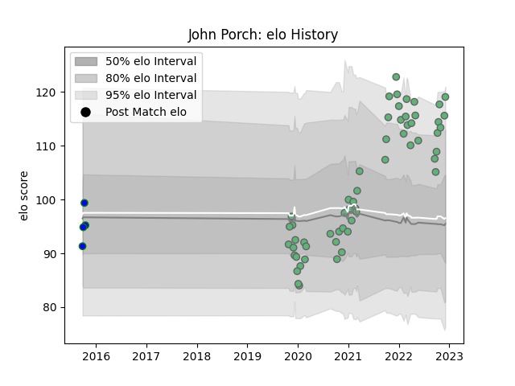

---  
layout: page  
title: John Porch  
date: 2023-02-02 18:49:33.960981  
categories: player  
---
# John Porch

## Positions: W, FB

## Current elo: 127.0

## Current Percentile: 93.0

# Elo History

# Match History

| Team               |   Appearances |   Win Rate |
|:-------------------|--------------:|-----------:|
| Connacht           |            63 |    0.52381 |
| North Harbour Rays |             4 |    0.25    |

| Opponent             |   Matches |   Win Rate |
|:---------------------|----------:|-----------:|
| Ulster               |         7 |   0.285714 |
| Munster              |         7 |   0.285714 |
| Benetton Treviso     |         5 |   1        |
| Leinster             |         5 |   0.2      |
| Cardiff Blues        |         4 |   0.5      |
| Scarlets             |         4 |   0.5      |
| Edinburgh            |         3 |   0.333333 |
| Ospreys              |         3 |   0.666667 |
| Montpellier Herault  |         2 |   0.5      |
| Stormers             |         2 |   0.5      |
| Stade Toulousain     |         2 |   0        |
| Southern Kings       |         2 |   1        |
| Sharks               |         2 |   0.5      |
| Lions                |         2 |   1        |
| Leicester Tigers     |         2 |   0        |
| Gloucester Rugby     |         2 |   0.5      |
| Bulls                |         2 |   0.5      |
| Zebre                |         2 |   1        |
| Brive                |         1 |   1        |
| NSW Country Eagles   |         1 |   0        |
| Greater Sydney Rams  |         1 |   0        |
| Queensland Country   |         1 |   1        |
| Glasgow Warriors     |         1 |   1        |
| Dragons              |         1 |   1        |
| Stade Francais Paris |         1 |   1        |
| Cheetahs             |         1 |   1        |
| Canberra Vikings     |         1 |   0        |