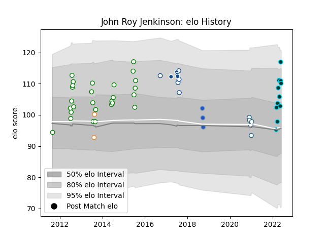

---  
layout: page  
title: John Roy Jenkinson  
date: 2023-02-24 02:28:09.115750  
categories: player  
---
# John Roy Jenkinson

## Positions: P

## Current elo: 110.0

## Current Percentile: 85.0

# Elo History

# Match History

| Team                 |   Appearances |   Win Rate |
|:---------------------|--------------:|-----------:|
| Leopards             |            27 |   0.592593 |
| Rugby ATL            |            11 |   0.727273 |
| Blue Bulls           |             5 |   0.6      |
| Griquas              |             5 |   0        |
| Bulls                |             4 |   0.25     |
| Munakata Sanix Blues |             3 |   0        |
| Free State Cheetahs  |             2 |   0.5      |

| Opponent                         |   Matches |   Win Rate |
|:---------------------------------|----------:|-----------:|
| Griffons                         |         5 |   0.4      |
| Pumas                            |         5 |   0.2      |
| Griquas                          |         4 |   0.5      |
| Natal Sharks                     |         3 |   0        |
| Valke                            |         3 |   1        |
| SWD Eagles                       |         3 |   1        |
| Western Province                 |         3 |   0        |
| Border Bulldogs                  |         3 |   1        |
| Boland Cavaliers                 |         3 |   1        |
| Eastern Province Kings           |         3 |   0.333333 |
| Golden Lions                     |         3 |   0.666667 |
| Toronto Arrows                   |         2 |   1        |
| New England Free Jacks           |         2 |   0        |
| Green Rockets Tokatsu            |         1 |   0        |
| Toyota Industries Shuttles Aichi |         1 |   0        |
| Stormers                         |         1 |   0        |
| Southern Kings                   |         1 |   0        |
| Sharks                           |         1 |   1        |
| San Diego Legion                 |         1 |   1        |
| R.U. New York                    |         1 |   1        |
| Rugby New York                   |         1 |   1        |
| Blues                            |         1 |   0        |
| NOLA Gold                        |         1 |   1        |
| L. A. Giltinis                   |         1 |   0        |
| Kobelco Kobe Steelers            |         1 |   0        |
| Houston SaberCats                |         1 |   1        |
| Free State Cheetahs              |         1 |   0        |
| Austin Gilgronis                 |         1 |   1        |