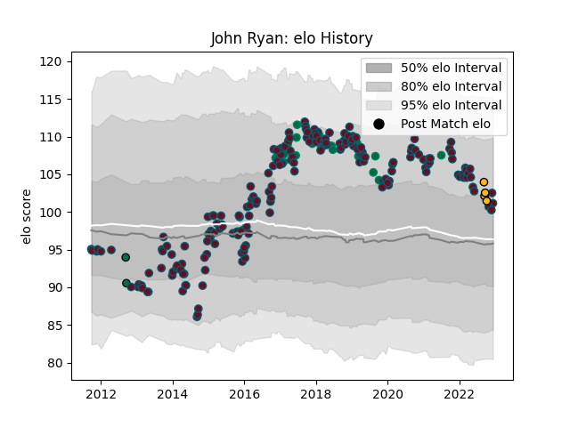

---  
layout: page  
title: John Ryan  
date: 2022-12-18 16:14:59.213710  
categories: player  
---
# John Ryan

## Positions: P

## Country: Ireland

## Current elo: 103.0

## Current Percentile: 71.0

# Elo History

# Match History

| Team         |   Appearances |   Win Rate |
|:-------------|--------------:|-----------:|
| Munster      |           197 |   0.65736  |
| Ireland      |            21 |   0.857143 |
| Wasps        |             4 |   0.25     |
| London Irish |             2 |   0        |

| Opponent                 |   Matches |   Win Rate |
|:-------------------------|----------:|-----------:|
| Ulster                   |        17 |   0.5      |
| Leinster                 |        15 |   0.2      |
| Edinburgh                |        15 |   0.866667 |
| Connacht                 |        15 |   0.733333 |
| Ospreys                  |        14 |   0.785714 |
| Glasgow Warriors         |        14 |   0.5      |
| Scarlets                 |        13 |   0.653846 |
| Cardiff Blues            |        13 |   0.769231 |
| Benetton Treviso         |        12 |   0.833333 |
| Zebre                    |        11 |   1        |
| Dragons                  |         8 |   0.75     |
| Racing 92                |         8 |   0.5625   |
| Leicester Tigers         |         6 |   0.5      |
| Castres Olympique        |         5 |   0.7      |
| Saracens                 |         5 |   0.2      |
| Cheetahs                 |         4 |   1        |
| Gloucester Rugby         |         4 |   0.5      |
| Southern Kings           |         3 |   1        |
| France                   |         3 |   1        |
| Italy                    |         3 |   1        |
| Japan                    |         3 |   1        |
| Stade Toulousain         |         3 |   0.666667 |
| Northampton Saints       |         3 |   0.666667 |
| Wales                    |         3 |   0.666667 |
| Toulon                   |         2 |   0.5      |
| Stade Francais Paris     |         2 |   0.5      |
| Clermont Auvergne        |         2 |   0        |
| Australia                |         2 |   0.5      |
| Exeter Chiefs            |         2 |   0.75     |
| Bath Rugby               |         1 |   1        |
| United States of America |         1 |   1        |
| South Africa             |         1 |   1        |
| Wasps                    |         1 |   0        |
| Sale Sharks              |         1 |   1        |
| Sharks                   |         1 |   1        |
| Scotland                 |         1 |   0        |
| Bristol Rugby            |         1 |   0        |
| England                  |         1 |   1        |
| Russia                   |         1 |   1        |
| Bulls                    |         1 |   0        |
| Canada                   |         1 |   1        |
| Lions                    |         1 |   0        |
| Argentina                |         1 |   1        |