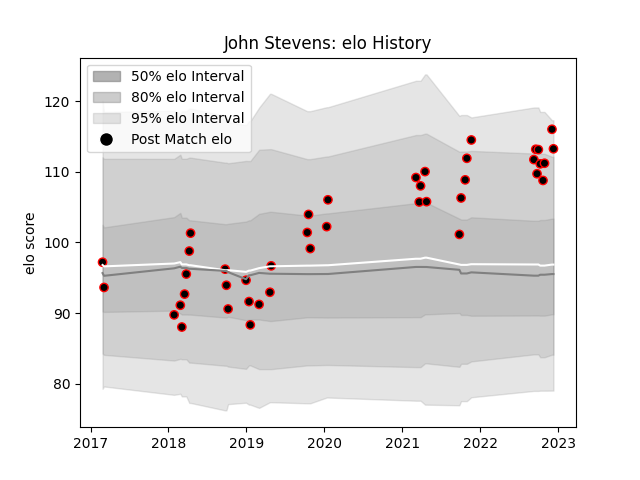

---  
layout: page  
title: John Stevens  
date: 2022-12-14 11:33:12.822594  
categories: player  
---
# John Stevens

## Positions: FL

## Current elo: 113.0

## Current Percentile: 93.0

# Elo History

# Match History

| Team            |   Appearances |   Win Rate |
|:----------------|--------------:|-----------:|
| Cornish Pirates |            42 |   0.642857 |

| Opponent            |   Matches |   Win Rate |
|:--------------------|----------:|-----------:|
| Nottingham          |         5 |   0.8      |
| Bedford             |         4 |   0.75     |
| Doncaster           |         4 |   0.75     |
| Ealing Trailfinders |         4 |   0.5      |
| Yorkshire Carnegie  |         4 |   0.75     |
| Coventry            |         3 |   0.333333 |
| Jersey              |         3 |   0.333333 |
| London Scottish     |         3 |   1        |
| Richmond            |         3 |   1        |
| Ampthill            |         2 |   0.5      |
| Hartpury College    |         2 |   0.5      |
| Rotherham Titans    |         2 |   0.5      |
| Caldy               |         1 |   0        |
| Newcastle Falcons   |         1 |   0        |
| Saracens            |         1 |   1        |