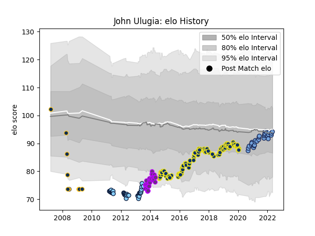

---  
layout: page  
title: John Ulugia  
date: 2023-02-24 09:54:51.503130  
categories: player  
---
# John Ulugia

## Positions: H

## Country: Australia A

## Current elo: 94.0

## Current Percentile: 48.0

# Elo History

# Match History

| Team                     |   Appearances |   Win Rate |
|:-------------------------|--------------:|-----------:|
| Clermont Auvergne        |           148 |   0.655405 |
| New South Wales Waratahs |            42 |   0.428571 |
| Bayonne                  |            31 |   0.435484 |
| US Bressane              |            27 |   0.277778 |
| Brumbies                 |             9 |   0.555556 |
| Australia A              |             2 |   1        |

| Opponent             |   Matches |   Win Rate |
|:---------------------|----------:|-----------:|
| Toulon               |        15 |   0.6      |
| La Rochelle          |        13 |   0.5      |
| Stade Toulousain     |        12 |   0.458333 |
| Racing 92            |        12 |   0.375    |
| Bordeaux Begles      |        12 |   0.625    |
| Lyon                 |        11 |   0.545455 |
| Stade Francais Paris |        11 |   0.590909 |
| Brive                |         9 |   0.666667 |
| Castres Olympique    |         9 |   0.444444 |
| Western Force        |         8 |   0.625    |
| Montpellier Herault  |         8 |   0.375    |
| Agen                 |         7 |   0.5      |
| Grenoble             |         6 |   0.833333 |
| Saracens             |         6 |   0.666667 |
| Pau                  |         6 |   0.333333 |
| Brumbies             |         5 |   0.6      |
| Northampton Saints   |         5 |   1        |
| Bayonne              |         4 |   0.75     |
| Queensland Reds      |         4 |   0        |
| Oyonnax              |         4 |   0.375    |
| Bulls                |         4 |   0        |
| Melbourne Rebels     |         4 |   0.75     |
| Blues                |         4 |   0.5      |
| Narbonne             |         4 |   0.5      |
| Exeter Chiefs        |         3 |   0.666667 |
| Chiefs               |         3 |   0.333333 |
| Harlequins           |         3 |   1        |
| Crusaders            |         3 |   0.333333 |
| Cheetahs             |         3 |   0        |
| Beziers              |         3 |   0.666667 |
| Carcassonne          |         3 |   0.333333 |
| Colomiers            |         3 |   0        |
| Stormers             |         3 |   0.666667 |
| Ulster               |         3 |   0.666667 |
| Highlanders          |         3 |   0.666667 |
| Tarbes               |         2 |   0.5      |
| Sharks               |         2 |   0.5      |
| Bourgoin-Jallieu     |         2 |   0.5      |
| Timisoara Saracens   |         2 |   1        |
| Auch                 |         2 |   0.5      |
| Bath Rugby           |         2 |   1        |
| Perpignan            |         2 |   1        |
| Albi                 |         2 |   0        |
| Hurricanes           |         2 |   0        |
| Munster              |         2 |   1        |
| Mont-de-Marsan       |         2 |   0.25     |
| Lions                |         2 |   1        |
| Dax                  |         2 |   0.5      |
| Clermont Auvergne    |         1 |   1        |
| Dragons              |         1 |   1        |
| US Bressane          |         1 |   1        |
| Aurillac             |         1 |   1        |
| Tonga                |         1 |   1        |
| Leicester Tigers     |         1 |   0        |
| Leinster             |         1 |   1        |
| Southern Kings       |         1 |   1        |
| Ospreys              |         1 |   0        |
| Montauban            |         1 |   1        |
| Samoa                |         1 |   1        |
| Sale Sharks          |         1 |   1        |
| Rouen                |         1 |   1        |
| Biarritz Olympique   |         1 |   0.5      |
| Provence Rugby       |         1 |   1        |
| Nevers               |         1 |   1        |
| Zebre                |         1 |   0.5      |