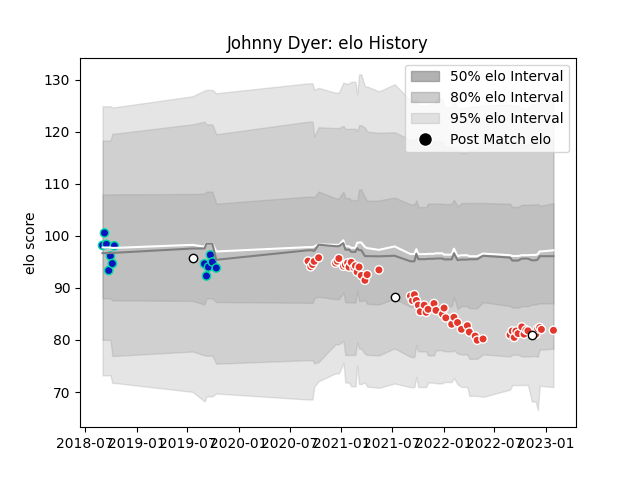

---  
layout: page  
title: Johnny Dyer  
date: 2023-02-02 19:06:12.477855  
categories: player  
---
# Johnny Dyer

## Positions: L, N8

## Country: Fiji

## Current elo: 82.0

## Current Percentile: 15.0

# Elo History

# Match History

| Team               |   Appearances |   Win Rate |
|:-------------------|--------------:|-----------:|
| Biarritz Olympique |            58 |   0.474138 |
| Fijian Drua        |            13 |   0.692308 |
| Fiji               |             3 |   0        |

| Opponent                   |   Matches |   Win Rate |
|:---------------------------|----------:|-----------:|
| Colomiers                  |         3 |   1        |
| Rouen                      |         3 |   0.666667 |
| Oyonnax                    |         3 |   0.666667 |
| Montauban                  |         3 |   0.666667 |
| Perpignan                  |         3 |   0.333333 |
| Grenoble                   |         3 |   0.833333 |
| Beziers                    |         3 |   0.333333 |
| Carcassonne                |         3 |   0.666667 |
| Stade Francais Paris       |         2 |   0.5      |
| Nevers                     |         2 |   0.75     |
| Sydney Rays                |         2 |   1        |
| Racing 92                  |         2 |   0.5      |
| Queensland Country         |         2 |   0.5      |
| Provence Rugby             |         2 |   1        |
| Toulon                     |         2 |   0        |
| Pau                        |         2 |   0        |
| Valence Romans Drome Rugby |         2 |   0.5      |
| Vannes                     |         2 |   0.5      |
| Agen                       |         2 |   0        |
| NSW Country Eagles         |         2 |   0.75     |
| Clermont Auvergne          |         2 |   0        |
| La Rochelle                |         2 |   0.5      |
| Bordeaux Begles            |         2 |   0.5      |
| Brisbane City              |         2 |   0.75     |
| Brive                      |         2 |   0.5      |
| Canberra Vikings           |         2 |   0.5      |
| Western Force              |         2 |   0.5      |
| Mont-de-Marsan             |         2 |   0.25     |
| Montpellier Herault        |         2 |   0        |
| Ireland                    |         1 |   0        |
| New Zealand Maori          |         1 |   0        |
| Soyaux-Angouleme           |         1 |   1        |
| Castres Olympique          |         1 |   0        |
| Stade Toulousain           |         1 |   0        |
| Lyon                       |         1 |   0        |
| Melbourne Rising           |         1 |   1        |
| New Zealand                |         1 |   0        |