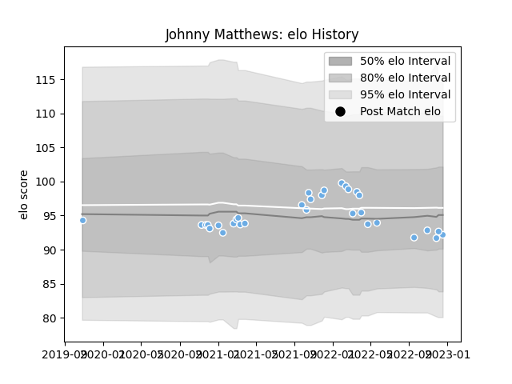

---  
layout: page  
title: Johnny Matthews  
date: 2023-02-02 18:44:50.412590  
categories: player  
---
# Johnny Matthews

## Positions: H

## Country: Scotland

## Current elo: 102.0

## Current Percentile: 70.0

# Elo History

# Match History

| Team             |   Appearances |   Win Rate |
|:-----------------|--------------:|-----------:|
| Glasgow Warriors |            35 |   0.528571 |
| Scotland         |             1 |   1        |

| Opponent         |   Matches |   Win Rate |
|:-----------------|----------:|-----------:|
| Benetton Treviso |         5 |        0.6 |
| Dragons          |         4 |        0.5 |
| Edinburgh        |         4 |        0.5 |
| Zebre            |         4 |        1   |
| Leinster         |         3 |        0   |
| Ulster           |         3 |        0   |
| Cardiff Blues    |         2 |        0.5 |
| Munster          |         2 |        0.5 |
| Perpignan        |         2 |        1   |
| Bath Rugby       |         1 |        0.5 |
| Chile            |         1 |        1   |
| Connacht         |         1 |        1   |
| Lions            |         1 |        1   |
| Ospreys          |         1 |        1   |
| Scarlets         |         1 |        0   |
| Stormers         |         1 |        0   |