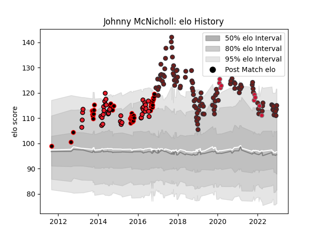

---  
layout: page  
title: Johnny McNicholl  
date: 2023-01-06 00:20:05.231281  
categories: player  
---
# Johnny McNicholl

## Positions: W, FB

## Country: Wales

## Current elo: 111.0

## Current Percentile: 68.0

# Elo History

# Match History

| Team       |   Appearances |   Win Rate |
|:-----------|--------------:|-----------:|
| Scarlets   |           103 |   0.563107 |
| Canterbury |            42 |   0.809524 |
| Crusaders  |            39 |   0.692308 |
| Wales      |             9 |   0.222222 |

| Opponent                 |   Matches |   Win Rate |
|:-------------------------|----------:|-----------:|
| Leinster                 |        10 |   0.3      |
| Benetton Treviso         |        10 |   0.7      |
| Cardiff Blues            |         9 |   0.555556 |
| Ospreys                  |         9 |   0.611111 |
| Edinburgh                |         8 |   0.375    |
| Zebre                    |         7 |   1        |
| Auckland                 |         6 |   0.833333 |
| Connacht                 |         6 |   0.666667 |
| Southern Kings           |         6 |   1        |
| Lions                    |         6 |   0.666667 |
| Dragons                  |         6 |   0.666667 |
| Tasman                   |         6 |   0.666667 |
| Cheetahs                 |         5 |   0.8      |
| Counties Manukau         |         5 |   0.8      |
| Ulster                   |         5 |   0.4      |
| Munster                  |         5 |   0.6      |
| Chiefs                   |         4 |   0.25     |
| Toulon                   |         4 |   0        |
| Taranaki                 |         4 |   0.75     |
| Highlanders              |         4 |   0.75     |
| Hurricanes               |         4 |   0        |
| Otago                    |         4 |   1        |
| North Harbour            |         4 |   0.75     |
| Stormers                 |         3 |   0.666667 |
| Waikato                  |         3 |   1        |
| Sharks                   |         3 |   0.666667 |
| Melbourne Rebels         |         3 |   0.666667 |
| Manawatu                 |         3 |   0.666667 |
| Glasgow Warriors         |         3 |   0.666667 |
| Blues                    |         3 |   1        |
| Hawke's Bay              |         2 |   1        |
| Bayonne                  |         2 |   1        |
| Racing 92                |         2 |   0        |
| Queensland Reds          |         2 |   1        |
| Ireland                  |         2 |   0        |
| Northland                |         2 |   1        |
| Italy                    |         2 |   0.5      |
| New South Wales Waratahs |         2 |   0.5      |
| Wellington               |         2 |   0.5      |
| Western Force            |         2 |   1        |
| France                   |         1 |   0        |
| Bulls                    |         1 |   1        |
| Brumbies                 |         1 |   1        |
| England                  |         1 |   0        |
| Australia                |         1 |   1        |
| Saracens                 |         1 |   0.5      |
| Southland                |         1 |   1        |
| South Africa             |         1 |   0        |
| London Irish             |         1 |   1        |
| Bath Rugby               |         1 |   0        |
| New Zealand              |         1 |   0        |
| Jaguares                 |         1 |   1        |
| Leicester Tigers         |         1 |   1        |
| Bristol Rugby            |         1 |   0        |
| Bordeaux Begles          |         1 |   0        |