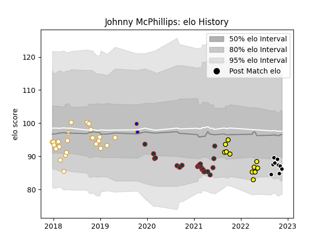

---  
layout: page  
title: Johnny McPhillips  
date: 2022-12-18 16:23:27.611569  
categories: player  
---
# Johnny McPhillips

## Positions: FH

## Current elo: 92.0

## Current Percentile: 30.0

# Elo History

# Match History

| Team             |   Appearances |   Win Rate |
|:-----------------|--------------:|-----------:|
| Ulster           |            27 |   0.592593 |
| Leicester Tigers |            22 |   0.454545 |
| Provence Rugby   |            12 |   0.5      |
| Carcassonne      |            11 |   0.545455 |
| Doncaster        |             2 |   0.5      |

| Opponent           |   Matches |   Win Rate |
|:-------------------|----------:|-----------:|
| Wasps              |         4 |   0.5      |
| Leinster           |         3 |   0.333333 |
| Bristol Rugby      |         3 |   0        |
| Sale Sharks        |         3 |   0        |
| Munster            |         3 |   0.833333 |
| Connacht           |         3 |   0        |
| Scarlets           |         3 |   0.666667 |
| Worcester Warriors |         3 |   1        |
| Bath Rugby         |         2 |   0        |
| Edinburgh          |         2 |   0.5      |
| Mont-de-Marsan     |         2 |   0.5      |
| Nevers             |         2 |   0        |
| Ospreys            |         2 |   1        |
| Grenoble           |         2 |   0.5      |
| Rouen              |         2 |   1        |
| Montauban          |         2 |   0.5      |
| Beziers            |         2 |   1        |
| Colomiers          |         2 |   0.5      |
| Cardiff Blues      |         2 |   0.5      |
| Saracens           |         1 |   0        |
| US Bressane        |         1 |   1        |
| Southern Kings     |         1 |   1        |
| Racing 92          |         1 |   0        |
| Provence Rugby     |         1 |   0        |
| Northampton Saints |         1 |   1        |
| Newcastle Falcons  |         1 |   1        |
| Soyaux-Angouleme   |         1 |   1        |
| Vannes             |         1 |   0        |
| Agen               |         1 |   0        |
| Massy              |         1 |   0        |
| Dragons            |         1 |   1        |
| Bayonne            |         1 |   1        |
| Benetton Treviso   |         1 |   1        |
| Biarritz Olympique |         1 |   0        |
| Calvisano          |         1 |   1        |
| Cheetahs           |         1 |   0.5      |
| Cornish Pirates    |         1 |   0        |
| Exeter Chiefs      |         1 |   0        |
| London Irish       |         1 |   1        |
| Glasgow Warriors   |         1 |   1        |
| Gloucester Rugby   |         1 |   1        |
| Harlequins         |         1 |   0        |
| Hartpury College   |         1 |   1        |
| La Rochelle        |         1 |   1        |
| Aurillac           |         1 |   1        |
| Zebre              |         1 |   1        |