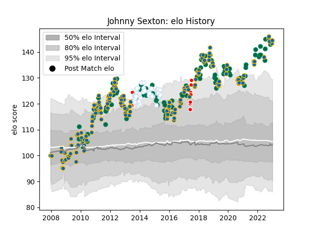

---  
layout: page  
title: Johnny Sexton  
date: 2023-01-06 00:26:08.701195  
categories: player  
---
# Johnny Sexton

## Positions: FH

## Country: Ireland

## Current elo: 144.0

## Current Percentile: 98.0

# Elo History

# Match History

| Team                    |   Appearances |   Win Rate |
|:------------------------|--------------:|-----------:|
| Leinster                |           160 |   0.784375 |
| Ireland                 |           104 |   0.663462 |
| Racing 92               |            38 |   0.565789 |
| British and Irish Lions |            10 |   0.65     |
| Edinburgh               |             1 |   0        |

| Opponent                 |   Matches |   Win Rate |
|:-------------------------|----------:|-----------:|
| Munster                  |        22 |   0.727273 |
| New Zealand              |        17 |   0.382353 |
| Wales                    |        16 |   0.46875  |
| Ulster                   |        15 |   0.866667 |
| Scarlets                 |        15 |   0.733333 |
| England                  |        14 |   0.5      |
| Scotland                 |        12 |   0.916667 |
| France                   |        11 |   0.590909 |
| Italy                    |        11 |   1        |
| Clermont Auvergne        |        10 |   0.55     |
| Australia                |        10 |   0.6      |
| Connacht                 |         9 |   0.666667 |
| Glasgow Warriors         |         9 |   0.888889 |
| Edinburgh                |         9 |   0.888889 |
| Ospreys                  |         8 |   0.75     |
| Cardiff Blues            |         7 |   0.928571 |
| Saracens                 |         6 |   0.5      |
| Bath Rugby               |         6 |   0.833333 |
| Montpellier Herault      |         6 |   0.5      |
| South Africa             |         6 |   0.666667 |
| Argentina                |         6 |   1        |
| Stade Francais Paris     |         5 |   0.6      |
| Castres Olympique        |         5 |   0.5      |
| Dragons                  |         5 |   1        |
| Wasps                    |         5 |   0.6      |
| Benetton Treviso         |         5 |   1        |
| Toulon                   |         5 |   0.4      |
| Stade Toulousain         |         5 |   0.6      |
| Zebre                    |         4 |   1        |
| Exeter Chiefs            |         4 |   1        |
| Leicester Tigers         |         3 |   0.666667 |
| Brive                    |         3 |   0.833333 |
| Northampton Saints       |         3 |   1        |
| Oyonnax                  |         3 |   0.333333 |
| Bayonne                  |         3 |   1        |
| Racing 92                |         3 |   1        |
| Harlequins               |         2 |   0        |
| Bulls                    |         2 |   0.5      |
| Bordeaux Begles          |         2 |   0.5      |
| Biarritz Olympique       |         2 |   1        |
| Russia                   |         2 |   1        |
| Samoa                    |         1 |   1        |
| Sharks                   |         1 |   1        |
| United States of America |         1 |   1        |
| Aironi                   |         1 |   1        |
| Provincial Union XV      |         1 |   1        |
| Perpignan                |         1 |   1        |
| New Zealand Maori        |         1 |   1        |
| Lyon                     |         1 |   1        |
| London Irish             |         1 |   0.5      |
| Japan                    |         1 |   1        |
| Grenoble                 |         1 |   0        |
| Gloucester Rugby         |         1 |   1        |
| Fiji                     |         1 |   1        |
| Crusaders                |         1 |   1        |
| Canada                   |         1 |   1        |
| Blues                    |         1 |   0        |
| La Rochelle              |         1 |   0.5      |