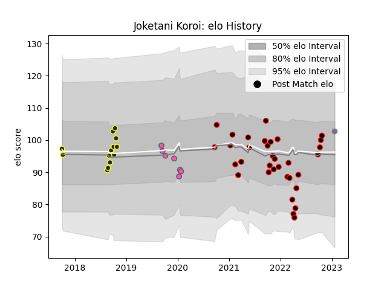

---  
layout: page  
title: Joketani Koroi  
date: 2023-01-23 15:29:06.605190  
categories: player  
---
# Joketani Koroi

## Positions: L, FL

## Current elo: 103.0

## Current Percentile: 55.0

# Elo History

# Match History

| Team                 |   Appearances |   Win Rate |
|:---------------------|--------------:|-----------:|
| Nice                 |            33 |   0.636364 |
| Otago                |            13 |   0.538462 |
| Stade Francais Paris |             7 |   0.142857 |
| Bourgoin-Jallieu     |             1 |   1        |

| Opponent                   |   Matches |   Win Rate |
|:---------------------------|----------:|-----------:|
| Tarbes                     |         5 |   0.9      |
| Bourgoin-Jallieu           |         4 |   0.75     |
| Dijon                      |         3 |   0.666667 |
| Cognac Saint Jean d'Angély |         3 |   0.666667 |
| Suresnes                   |         3 |   0.666667 |
| Massy                      |         3 |   0.666667 |
| Wellington                 |         2 |   0        |
| Waikato                    |         2 |   0.5      |
| Valence Romans Drome Rugby |         2 |   0        |
| Hawke's Bay                |         2 |   0.5      |
| Aubenas                    |         2 |   1        |
| Dax                        |         2 |   0.5      |
| Albi                       |         2 |   0.75     |
| Bay of Plenty              |         2 |   0.5      |
| Chambery                   |         2 |   0.5      |
| Clermont Auvergne          |         1 |   0        |
| Soyaux-Angouleme           |         1 |   0        |
| Auckland                   |         1 |   1        |
| Bayonne                    |         1 |   1        |
| Tasman                     |         1 |   0        |
| Blagnac                    |         1 |   0        |
| Bordeaux Begles            |         1 |   0        |
| Southland                  |         1 |   1        |
| Northland                  |         1 |   1        |
| Nice                       |         1 |   1        |
| Bristol Rugby              |         1 |   0        |
| Manawatu                   |         1 |   1        |
| Brive                      |         1 |   0        |
| Castres Olympique          |         1 |   0        |
| Zebre                      |         1 |   0        |