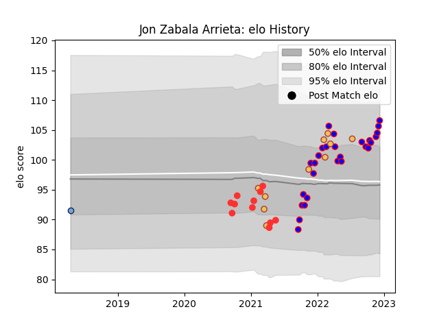

---  
layout: page  
title: Jon Zabala Arrieta  
date: 2022-11-22 11:29:09.440446  
categories: player  
---
# Jon Zabala Arrieta

## Positions: P

## Country: Spain

## Current elo: 105.0

## Current Percentile: 77.0

# Elo History

# Match History

| Team    |   Appearances |   Win Rate |
|:--------|--------------:|-----------:|
| Beziers |            24 |     0.4375 |
| Tarbes  |            11 |     0.5    |
| Spain   |            10 |     0.7    |
| Bayonne |             1 |     0      |

| Opponent                   |   Matches |   Win Rate |
|:---------------------------|----------:|-----------:|
| Narbonne                   |         5 |   0.4      |
| Colomiers                  |         3 |   0.333333 |
| Massy                      |         3 |   0.666667 |
| Portugal                   |         3 |   0.666667 |
| Vannes                     |         2 |   0        |
| Bayonne                    |         2 |   0.5      |
| US Bressane                |         2 |   0.5      |
| Russia                     |         2 |   1        |
| Dax                        |         2 |   0.5      |
| Rouen                      |         2 |   0.5      |
| Romania                    |         2 |   0.5      |
| Mont-de-Marsan             |         2 |   0.5      |
| Oyonnax                    |         2 |   0.25     |
| Nice                       |         1 |   0.5      |
| Soyaux-Angouleme           |         1 |   0        |
| Provence Rugby             |         1 |   0        |
| Agen                       |         1 |   1        |
| Nevers                     |         1 |   1        |
| Netherlands                |         1 |   1        |
| Albi                       |         1 |   1        |
| Grenoble                   |         1 |   1        |
| Georgia                    |         1 |   0        |
| Dijon                      |         1 |   0        |
| Cognac Saint Jean d'Angély |         1 |   1        |
| Carcassonne                |         1 |   0        |
| Canada                     |         1 |   1        |
| Montauban                  |         1 |   0        |