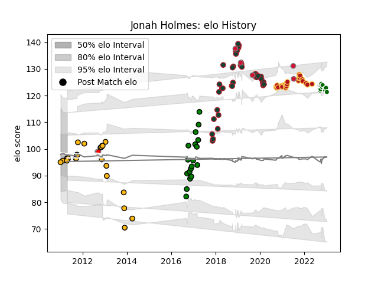

---  
layout: page  
title: Jonah Holmes  
date: 2022-12-18 16:20:50.448730  
categories: player  
---
# Jonah Holmes

## Positions: W, FB

## Country: Wales

## Current elo: 110.0

## Current Percentile: 86.0

# Elo History

# Match History

| Team                |   Appearances |   Win Rate |
|:--------------------|--------------:|-----------:|
| Leicester Tigers    |            41 |   0.414634 |
| Wasps               |            23 |   0.347826 |
| Dragons             |            22 |   0.25     |
| Yorkshire Carnegie  |            18 |   0.777778 |
| Ealing Trailfinders |             9 |   1        |
| Wales               |             5 |   0.7      |
| London Welsh        |             2 |   0.5      |

| Opponent            |   Matches |   Win Rate |
|:--------------------|----------:|-----------:|
| Saracens            |         8 |   0.125    |
| Worcester Warriors  |         7 |   0.428571 |
| Sale Sharks         |         7 |   0.428571 |
| Bath Rugby          |         5 |   0.2      |
| Ulster              |         5 |   0        |
| Leicester Tigers    |         4 |   0.5      |
| Exeter Chiefs       |         4 |   0.25     |
| Wasps               |         4 |   0.5      |
| Cardiff Blues       |         4 |   0.25     |
| Ospreys             |         4 |   0.25     |
| Newcastle Falcons   |         3 |   0.333333 |
| Northampton Saints  |         3 |   0.333333 |
| Nottingham          |         3 |   1        |
| Gloucester Rugby    |         3 |   1        |
| London Irish        |         3 |   0        |
| Richmond            |         3 |   1        |
| Leinster            |         3 |   0        |
| Doncaster           |         3 |   0.666667 |
| Scarlets            |         3 |   0.333333 |
| Bedford             |         3 |   1        |
| Pau                 |         2 |   0.5      |
| Mogliano            |         2 |   1        |
| London Scottish     |         2 |   1        |
| Rotherham Titans    |         2 |   1        |
| Zebre               |         2 |   0.5      |
| Cornish Pirates     |         2 |   1        |
| Bristol Rugby       |         2 |   0        |
| Harlequins          |         2 |   1        |
| Glasgow Warriors    |         2 |   0.5      |
| Edinburgh           |         2 |   0.5      |
| Jersey              |         2 |   0.5      |
| Argentina           |         1 |   0.5      |
| Yorkshire Carnegie  |         1 |   1        |
| Benetton Treviso    |         1 |   0.5      |
| Canada              |         1 |   1        |
| Tonga               |         1 |   1        |
| Stormers            |         1 |   0        |
| Connacht            |         1 |   1        |
| Dragons             |         1 |   0        |
| Coventry            |         1 |   1        |
| Ealing Trailfinders |         1 |   1        |
| Racing 92           |         1 |   0        |
| Hartpury College    |         1 |   1        |
| Ireland             |         1 |   0        |
| Italy               |         1 |   1        |
| London Welsh        |         1 |   1        |
| Ampthill            |         1 |   1        |