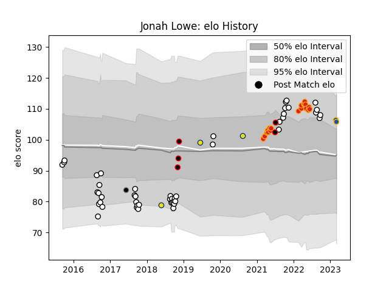

---  
layout: page  
title: Jonah Lowe  
date: 2023-03-02 11:21:59.879329  
categories: player  
---
# Jonah Lowe

## Positions: W, C

## Country: New Zealand Maori

## Current elo: 107.0

## Current Percentile: 82.0

# Elo History

# Match History

| Team                |   Appearances |   Win Rate |
|:--------------------|--------------:|-----------:|
| Hawke's Bay         |            47 |   0.404255 |
| Chiefs              |            19 |   0.789474 |
| New Zealand Maori   |             5 |   1        |
| Hurricanes          |             3 |   0.666667 |
| Highlanders         |             1 |   0        |
| Provincial Union XV |             1 |   0        |

| Opponent                 |   Matches |   Win Rate |
|:-------------------------|----------:|-----------:|
| Otago                    |         5 |   0.6      |
| Wellington               |         5 |   0.3      |
| Bay of Plenty            |         5 |   0.4      |
| Canterbury               |         5 |   0.2      |
| Manawatu                 |         4 |   1        |
| Tasman                   |         4 |   0.25     |
| Moana Pasifika           |         4 |   1        |
| Counties Manukau         |         4 |   0.25     |
| Crusaders                |         4 |   0.25     |
| Waikato                  |         4 |   0.375    |
| Taranaki                 |         3 |   0        |
| Highlanders              |         3 |   0.666667 |
| Southland                |         3 |   1        |
| Samoa                    |         2 |   1        |
| Hurricanes               |         2 |   1        |
| Brumbies                 |         2 |   0.5      |
| New South Wales Waratahs |         2 |   1        |
| North Harbour            |         2 |   0        |
| Northland                |         2 |   0.5      |
| Blues                    |         2 |   0.5      |
| United States of America |         1 |   1        |
| Auckland                 |         1 |   0        |
| Queensland Reds          |         1 |   1        |
| Fijian Drua              |         1 |   1        |
| Chile                    |         1 |   1        |
| Chiefs                   |         1 |   1        |
| British and Irish Lions  |         1 |   0        |
| Brazil                   |         1 |   1        |
| Western Force            |         1 |   1        |