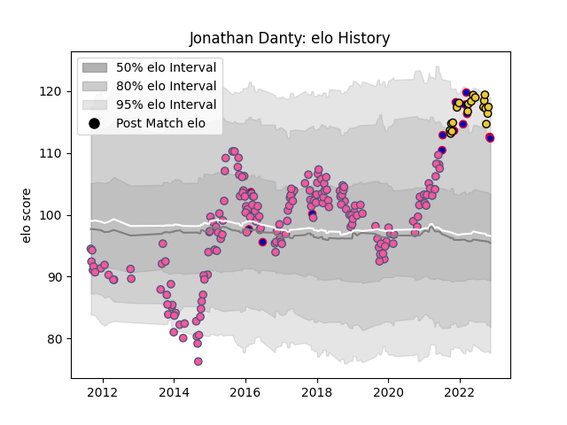

---  
layout: page  
title: Jonathan Danty  
date: 2022-12-18 16:38:13.229115  
categories: player  
---
# Jonathan Danty

## Positions: C

## Country: France

## Current elo: 113.0

## Current Percentile: 86.0

# Elo History

# Match History

| Team                 |   Appearances |   Win Rate |
|:---------------------|--------------:|-----------:|
| Stade Francais Paris |           179 |   0.547486 |
| La Rochelle          |            22 |   0.727273 |
| France               |            16 |   0.75     |

| Opponent             |   Matches |   Win Rate |
|:---------------------|----------:|-----------:|
| Racing 92            |        16 |   0.5      |
| Toulon               |        16 |   0.5625   |
| Clermont Auvergne    |        14 |   0.357143 |
| Stade Toulousain     |        14 |   0.214286 |
| Castres Olympique    |        14 |   0.714286 |
| Bordeaux Begles      |        12 |   0.666667 |
| Montpellier Herault  |        11 |   0.5      |
| Lyon                 |        11 |   0.454545 |
| Brive                |        10 |   0.7      |
| La Rochelle          |         8 |   0.5625   |
| Agen                 |         8 |   0.5      |
| Bayonne              |         8 |   0.625    |
| Pau                  |         6 |   0.666667 |
| Grenoble             |         6 |   0.666667 |
| Perpignan            |         5 |   1        |
| Oyonnax              |         5 |   0.2      |
| London Irish         |         4 |   0.5      |
| Biarritz Olympique   |         3 |   1        |
| Edinburgh            |         3 |   0.666667 |
| Worcester Warriors   |         3 |   0.333333 |
| Australia            |         3 |   0.666667 |
| Stade Francais Paris |         2 |   0.5      |
| Wales                |         2 |   0.5      |
| Ospreys              |         2 |   1        |
| New Zealand          |         2 |   0.5      |
| Munster              |         2 |   0.5      |
| Leicester Tigers     |         2 |   0.5      |
| Argentina            |         2 |   0.5      |
| Italy                |         2 |   1        |
| Benetton Treviso     |         2 |   1        |
| Bristol Rugby        |         2 |   0        |
| Lusitanos XV         |         1 |   1        |
| Scotland             |         1 |   1        |
| Bath Rugby           |         1 |   1        |
| Ulster               |         1 |   1        |
| Bucuresti            |         1 |   1        |
| Cavalieri Prato      |         1 |   1        |
| South Africa         |         1 |   1        |
| England              |         1 |   1        |
| Crociati Rugby       |         1 |   1        |
| London Welsh         |         1 |   1        |
| Gloucester Rugby     |         1 |   1        |
| Harlequins           |         1 |   0        |
| Ireland              |         1 |   1        |
| Northampton Saints   |         1 |   1        |
| Newcastle Falcons    |         1 |   1        |
| Japan                |         1 |   1        |
| Zebre                |         1 |   1        |