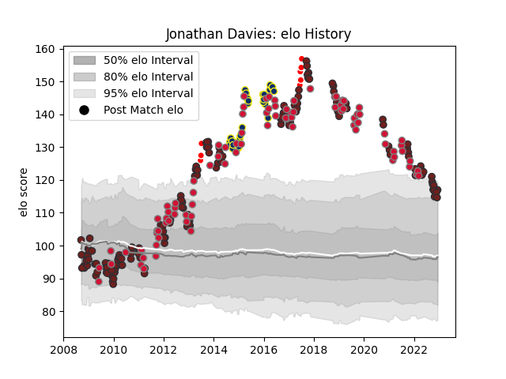

---  
layout: page  
title: Jonathan Davies  
date: 2022-12-09 13:23:59.640818  
categories: player  
---
# Jonathan Davies

## Positions: C

## Country: Wales

## Current elo: 115.0

## Current Percentile: 92.0

# Elo History

# Match History

| Team                    |   Appearances |   Win Rate |
|:------------------------|--------------:|-----------:|
| Scarlets                |           159 |   0.427673 |
| Wales                   |            89 |   0.550562 |
| Clermont Auvergne       |            32 |   0.703125 |
| British and Irish Lions |             8 |   0.6875   |

| Opponent                 |   Matches |   Win Rate |
|:-------------------------|----------:|-----------:|
| Cardiff Blues            |        16 |   0.5625   |
| Ospreys                  |        16 |   0.3125   |
| Ulster                   |        13 |   0.192308 |
| England                  |        12 |   0.416667 |
| Australia                |        12 |   0.333333 |
| Dragons                  |        12 |   0.75     |
| Munster                  |        12 |   0.25     |
| Edinburgh                |        11 |   0.363636 |
| Scotland                 |        11 |   0.818182 |
| Glasgow Warriors         |        11 |   0.272727 |
| France                   |        11 |   0.454545 |
| New Zealand              |        11 |   0.136364 |
| Leinster                 |        11 |   0.272727 |
| Connacht                 |        10 |   0.9      |
| South Africa             |         9 |   0.333333 |
| Ireland                  |         9 |   0.722222 |
| Italy                    |         7 |   1        |
| Racing 92                |         7 |   0.285714 |
| Benetton Treviso         |         6 |   0.333333 |
| Zebre                    |         5 |   0.9      |
| Brive                    |         5 |   0.8      |
| Bordeaux Begles          |         5 |   0.4      |
| Saracens                 |         4 |   0.625    |
| Sale Sharks              |         4 |   0.75     |
| Northampton Saints       |         4 |   0.5      |
| Toulon                   |         4 |   0.5      |
| Argentina                |         4 |   0.625    |
| Exeter Chiefs            |         3 |   0.333333 |
| London Irish             |         3 |   0.666667 |
| Stade Toulousain         |         2 |   0.5      |
| Stormers                 |         2 |   0        |
| Montpellier Herault      |         2 |   0.5      |
| Leicester Tigers         |         2 |   0        |
| Fiji                     |         2 |   1        |
| Bristol Rugby            |         2 |   0.5      |
| Canada                   |         2 |   1        |
| Castres Olympique        |         2 |   1        |
| Clermont Auvergne        |         2 |   0        |
| Grenoble                 |         2 |   1        |
| Lions                    |         2 |   0.5      |
| Lyon                     |         1 |   0        |
| United States of America |         1 |   1        |
| Bath Rugby               |         1 |   0        |
| Stade Francais Paris     |         1 |   1        |
| Southern Kings           |         1 |   1        |
| Crusaders                |         1 |   1        |
| Georgia                  |         1 |   1        |
| Samoa                    |         1 |   1        |
| Perpignan                |         1 |   0        |
| Pau                      |         1 |   1        |
| Oyonnax                  |         1 |   1        |
| Harlequins               |         1 |   1        |
| Japan                    |         1 |   1        |
| New Zealand Maori        |         1 |   1        |
| La Rochelle              |         1 |   1        |
| Namibia                  |         1 |   1        |
| Aironi                   |         1 |   1        |
| Agen                     |         1 |   1        |