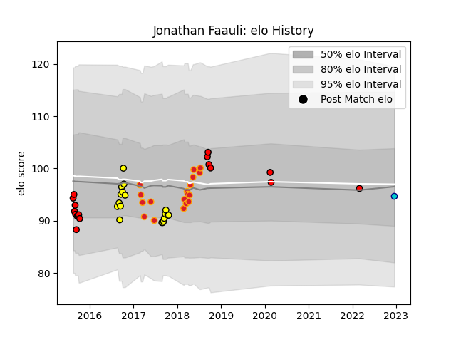

---  
layout: page  
title: Jonathan Faauli  
date: 2022-12-18 16:32:42.052077  
categories: player  
---
# Jonathan Faauli

## Positions: C

## Current elo: 95.0

## Current Percentile: 49.0

# Elo History

# Match History

| Team                      |   Appearances |   Win Rate |
|:--------------------------|--------------:|-----------:|
| Chiefs                    |            18 |   0.75     |
| Taranaki                  |            18 |   0.638889 |
| Counties Manukau          |            10 |   0.4      |
| Toshiba Brave Lupus Tokyo |             7 |   0.285714 |
| Shizuoka Blue Revs        |             1 |   0        |

| Opponent                |   Matches |   Win Rate |
|:------------------------|----------:|-----------:|
| Tasman                  |         5 |   0.4      |
| Blues                   |         4 |   0.875    |
| Auckland                |         3 |   0.666667 |
| Bay of Plenty           |         3 |   0.666667 |
| Hawke's Bay             |         2 |   0.5      |
| Waikato                 |         2 |   0.75     |
| Saitama Wild Knights    |         2 |   0        |
| North Harbour           |         2 |   0        |
| Manawatu                |         2 |   1        |
| Hurricanes              |         2 |   0.5      |
| Highlanders             |         2 |   1        |
| Wellington              |         2 |   0.5      |
| Canterbury              |         2 |   0        |
| Bulls                   |         2 |   1        |
| Counties Manukau        |         2 |   1        |
| Crusaders               |         1 |   0        |
| Stormers                |         1 |   1        |
| Black Rams Tokyo        |         1 |   1        |
| Urayasu D-Rocks         |         1 |   0        |
| Toyota Verblitz         |         1 |   0        |
| British and Irish Lions |         1 |   0        |
| Taranaki                |         1 |   0        |
| Sunwolves               |         1 |   1        |
| Shizuoka Blue Revs      |         1 |   0        |
| Southland               |         1 |   1        |
| Sharks                  |         1 |   0        |
| Brumbies                |         1 |   1        |
| Queensland Reds         |         1 |   1        |
| Northland               |         1 |   1        |
| Coca-Cola Red Sparks    |         1 |   1        |
| Kobelco Kobe Steelers   |         1 |   0        |
| Melbourne Rebels        |         1 |   1        |