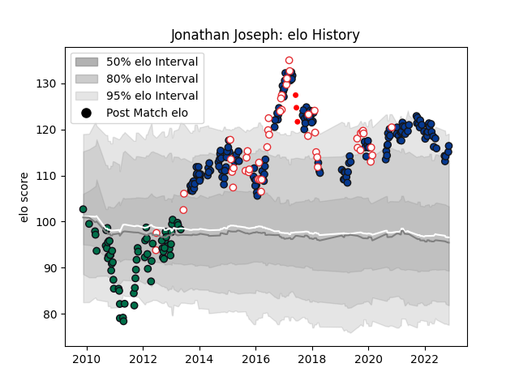

---  
layout: page  
title: Jonathan Joseph  
date: 2022-11-15 23:42:55.736053  
categories: player  
---
# Jonathan Joseph

## Positions: C

## Country: England

## Current elo: 116.0

## Current Percentile: 90.0

# Elo History

# Match History

| Team                    |   Appearances |   Win Rate |
|:------------------------|--------------:|-----------:|
| Bath Rugby              |           162 |   0.530864 |
| London Irish            |            66 |   0.386364 |
| England                 |            49 |   0.765306 |
| British and Irish Lions |             3 |   0.5      |

| Opponent                 |   Matches |   Win Rate |
|:-------------------------|----------:|-----------:|
| Leicester Tigers         |        20 |   0.525    |
| Wasps                    |        19 |   0.315789 |
| Northampton Saints       |        18 |   0.305556 |
| Gloucester Rugby         |        18 |   0.444444 |
| Sale Sharks              |        16 |   0.5      |
| Newcastle Falcons        |        16 |   0.6875   |
| Harlequins               |        15 |   0.4      |
| Worcester Warriors       |        14 |   0.785714 |
| Saracens                 |        14 |   0.321429 |
| Exeter Chiefs            |        13 |   0.384615 |
| London Irish             |         8 |   0.75     |
| Australia                |         7 |   0.857143 |
| Wales                    |         7 |   0.857143 |
| Bristol Rugby            |         7 |   0.571429 |
| France                   |         6 |   0.5      |
| Ireland                  |         6 |   0.5      |
| Toulon                   |         6 |   0.166667 |
| Scotland                 |         5 |   0.8      |
| Italy                    |         4 |   1        |
| Argentina                |         4 |   1        |
| South Africa             |         4 |   0.375    |
| Bordeaux Begles          |         4 |   1        |
| Scarlets                 |         4 |   0.25     |
| Stade Toulousain         |         3 |   0.333333 |
| Yorkshire Carnegie       |         3 |   0.333333 |
| Bath Rugby               |         3 |   0.333333 |
| Cardiff Blues            |         3 |   0.666667 |
| Leinster                 |         2 |   0        |
| Montpellier Herault      |         2 |   1        |
| Benetton Treviso         |         2 |   1        |
| Leeds                    |         2 |   0.5      |
| Pau                      |         2 |   1        |
| Glasgow Warriors         |         2 |   0.5      |
| Fiji                     |         2 |   1        |
| Mont-de-Marsan           |         2 |   1        |
| Dragons                  |         2 |   1        |
| Tonga                    |         1 |   1        |
| Brive                    |         1 |   1        |
| Uruguay                  |         1 |   1        |
| United States of America |         1 |   1        |
| Ulster                   |         1 |   0        |
| Edinburgh                |         1 |   0        |
| Clermont Auvergne        |         1 |   0        |
| Stade Francais Paris     |         1 |   0        |
| Highlanders              |         1 |   0        |
| Provincial Union XV      |         1 |   1        |
| Ospreys                  |         1 |   0        |
| Hurricanes               |         1 |   0.5      |
| New Zealand              |         1 |   1        |
| Munster                  |         1 |   1        |
| London Welsh             |         1 |   1        |