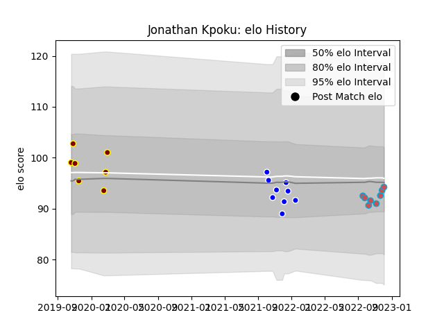

---  
layout: page  
title: Jonathan Kpoku  
date: 2023-03-27 11:35:32.241319  
categories: player  
---
# Jonathan Kpoku

Last updated: 2023-03-27
## Positions: L

## Current elo: 87.0

## Current Percentile: 21.0

# Elo History

# Match History

| Team             |   Appearances |   Win Rate |
|:-----------------|--------------:|-----------:|
| Ampthill         |             9 |   0.722222 |
| Bourgoin-Jallieu |             9 |   0.5      |
| Coventry         |             9 |   0.444444 |

| Opponent                   |   Matches |   Win Rate |
|:---------------------------|----------:|-----------:|
| Hartpury College           |         4 |       0.75 |
| London Scottish            |         3 |       0.5  |
| Jersey                     |         2 |       0    |
| US Bressane                |         2 |       0.25 |
| Nottingham                 |         2 |       0.5  |
| Yorkshire Carnegie         |         2 |       1    |
| Dax                        |         1 |       1    |
| Doncaster                  |         1 |       0    |
| Ealing Trailfinders        |         1 |       0    |
| Bedford                    |         1 |       1    |
| Coventry                   |         1 |       1    |
| Cognac Saint Jean d'Angély |         1 |       1    |
| Nice                       |         1 |       1    |
| Chambery                   |         1 |       1    |
| Richmond                   |         1 |       1    |
| Suresnes                   |         1 |       0    |
| Blagnac                    |         1 |       0    |
| Albi                       |         1 |       0    |