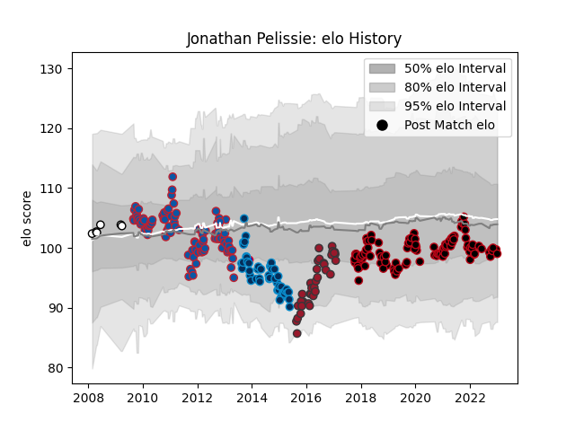

---  
layout: page  
title: Jonathan Pelissie  
date: 2023-01-06 00:10:58.544991  
categories: player  
---
# Jonathan Pelissie

## Positions: SH

## Country: France

## Current elo: 99.0

## Current Percentile: 34.0

# Elo History

# Match History

| Team                |   Appearances |   Win Rate |
|:--------------------|--------------:|-----------:|
| Lyon                |           105 |   0.5      |
| Grenoble            |            96 |   0.651042 |
| Montpellier Herault |            47 |   0.457447 |
| Toulon              |            36 |   0.472222 |
| Brive               |             6 |   0.5      |
| France              |             1 |   1        |

| Opponent             |   Matches |   Win Rate |
|:---------------------|----------:|-----------:|
| La Rochelle          |        17 |   0.294118 |
| Stade Francais Paris |        16 |   0.625    |
| Racing 92            |        16 |   0.28125  |
| Stade Toulousain     |        16 |   0.53125  |
| Clermont Auvergne    |        15 |   0.266667 |
| Castres Olympique    |        15 |   0.333333 |
| Pau                  |        14 |   0.678571 |
| Toulon               |        14 |   0.5      |
| Montpellier Herault  |        13 |   0.538462 |
| Bordeaux Begles      |        13 |   0.5      |
| Brive                |        10 |   0.5      |
| Agen                 |        10 |   0.7      |
| Oyonnax              |         9 |   0.666667 |
| Grenoble             |         8 |   0.75     |
| Bayonne              |         8 |   0.625    |
| Perpignan            |         7 |   0.571429 |
| Mont-de-Marsan       |         6 |   0.666667 |
| Auch                 |         6 |   0.833333 |
| Dax                  |         6 |   0.833333 |
| Narbonne             |         6 |   0.666667 |
| Tarbes               |         5 |   0.6      |
| Biarritz Olympique   |         5 |   0.6      |
| Provence Rugby       |         4 |   1        |
| Lyon                 |         4 |   0.375    |
| Colomiers            |         4 |   0.75     |
| Albi                 |         3 |   0.833333 |
| Benetton Treviso     |         3 |   0.666667 |
| Aurillac             |         3 |   0.833333 |
| Carcassonne          |         3 |   1        |
| Lannemezan           |         2 |   1        |
| Bath Rugby           |         2 |   0        |
| Northampton Saints   |         2 |   0        |
| Beziers              |         2 |   1        |
| Leinster             |         2 |   0        |
| Cavalieri Prato      |         2 |   1        |
| Périgueux            |         2 |   1        |
| Bourgoin-Jallieu     |         2 |   0.5      |
| Cardiff Blues        |         2 |   0        |
| Sale Sharks          |         2 |   1        |
| Saracens             |         2 |   0        |
| Scarlets             |         2 |   0.5      |
| Tonga                |         1 |   1        |
| Ulster               |         1 |   0        |
| Leicester Tigers     |         1 |   0        |
| Saint-Etienne        |         1 |   1        |
| London Welsh         |         1 |   1        |
| Glasgow Warriors     |         1 |   0        |
| Bulls                |         1 |   0        |
| Wasps                |         1 |   0        |