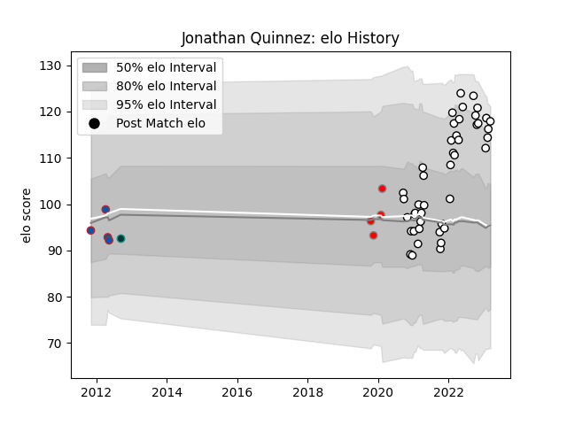

---  
layout: page  
title: Jonathan Quinnez  
date: 2023-03-21 18:22:08.825422  
categories: player  
---
# Jonathan Quinnez

Last updated: 2023-03-21
## Positions: C

## Current elo: 117.0

## Current Percentile: 88.0

# Elo History

# Match History

| Team                       |   Appearances |   Win Rate |
|:---------------------------|--------------:|-----------:|
| Valence Romans Drome Rugby |            44 |   0.590909 |
| Grenoble                   |             4 |   0.25     |
| Roval Drome XV             |             4 |   0        |
| Pau                        |             1 |   1        |

| Opponent                   |   Matches |   Win Rate |
|:---------------------------|----------:|-----------:|
| Suresnes                   |         4 |   1        |
| Tarbes                     |         3 |   0.333333 |
| Bourgoin-Jallieu           |         3 |   0.5      |
| Soyaux-Angouleme           |         3 |   0.333333 |
| Albi                       |         2 |   0.5      |
| Rouen                      |         2 |   0.5      |
| Narbonne                   |         2 |   1        |
| Montauban                  |         2 |   0.5      |
| Mont-de-Marsan             |         2 |   0.25     |
| Aubenas                    |         2 |   1        |
| Rennes                     |         2 |   1        |
| Colomiers                  |         2 |   0        |
| Dax                        |         2 |   0.5      |
| Oyonnax                    |         2 |   0        |
| Chambery                   |         2 |   1        |
| Carcassonne                |         2 |   1        |
| Blagnac                    |         2 |   0.5      |
| Biarritz Olympique         |         2 |   0.5      |
| Perpignan                  |         2 |   0        |
| Provence Rugby             |         1 |   0        |
| Massy                      |         1 |   0        |
| Nice                       |         1 |   0        |
| Nevers                     |         1 |   0        |
| Grenoble                   |         1 |   0        |
| Dijon                      |         1 |   1        |
| Cognac Saint Jean d'Angély |         1 |   1        |
| Carqueiranne-Hyères        |         1 |   1        |
| Aurillac                   |         1 |   1        |
| Vannes                     |         1 |   0        |