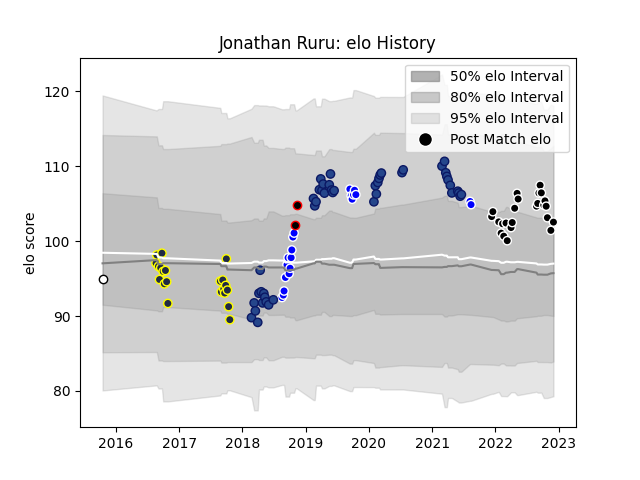

---  
layout: page  
title: Jonathan Ruru  
date: 2022-12-12 14:48:06.793466  
categories: player  
---
# Jonathan Ruru

## Positions: SH

## Country: New Zealand Maori

## Current elo: 103.0

## Current Percentile: 72.0

# Elo History

# Match History

| Team              |   Appearances |   Win Rate |
|:------------------|--------------:|-----------:|
| Blues             |            46 |   0.445652 |
| Provence Rugby    |            24 |   0.645833 |
| Otago             |            21 |   0.52381  |
| Auckland          |            20 |   0.75     |
| New Zealand Maori |             2 |   1        |
| Hawke's Bay       |             1 |   1        |

| Opponent                 |   Matches |   Win Rate |
|:-------------------------|----------:|-----------:|
| Highlanders              |         7 |   0.428571 |
| Crusaders                |         7 |   0        |
| Hurricanes               |         6 |   0.5      |
| Tasman                   |         6 |   0.333333 |
| Canterbury               |         5 |   0.6      |
| Bay of Plenty            |         5 |   0.6      |
| Wellington               |         5 |   0.6      |
| Chiefs                   |         5 |   0.2      |
| Southland                |         4 |   1        |
| Agen                     |         3 |   0.333333 |
| Counties Manukau         |         3 |   0.666667 |
| Queensland Reds          |         3 |   0.666667 |
| Oyonnax                  |         3 |   0.5      |
| Stormers                 |         3 |   0.666667 |
| North Harbour            |         3 |   0.666667 |
| New South Wales Waratahs |         3 |   1        |
| Bulls                    |         2 |   0.75     |
| Sharks                   |         2 |   0        |
| Northland                |         2 |   0.5      |
| Taranaki                 |         2 |   1        |
| Montauban                |         2 |   1        |
| Mont-de-Marsan           |         2 |   1        |
| Carcassonne              |         2 |   1        |
| Aurillac                 |         2 |   0.5      |
| Manawatu                 |         2 |   1        |
| Lions                    |         2 |   1        |
| Jaguares                 |         2 |   0        |
| Grenoble                 |         2 |   1        |
| Colomiers                |         2 |   0.5      |
| Auckland                 |         2 |   0.5      |
| Sunwolves                |         1 |   1        |
| Soyaux-Angouleme         |         1 |   1        |
| Waikato                  |         1 |   1        |
| United States of America |         1 |   1        |
| Vannes                   |         1 |   1        |
| Melbourne Rebels         |         1 |   0        |
| Otago                    |         1 |   0        |
| Nevers                   |         1 |   0        |
| Narbonne                 |         1 |   0        |
| Massy                    |         1 |   0        |
| Hawke's Bay              |         1 |   1        |
| Brumbies                 |         1 |   1        |
| Brazil                   |         1 |   1        |
| Bayonne                  |         1 |   1        |
| Western Force            |         1 |   1        |