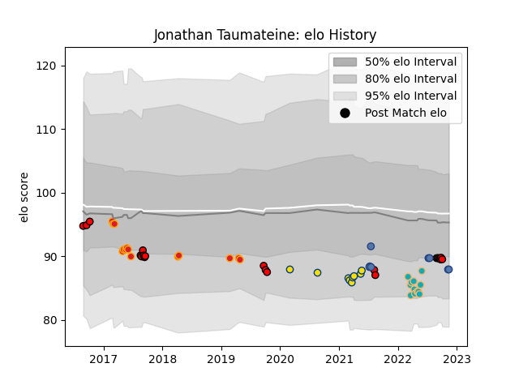

---  
layout: page  
title: Jonathan Taumateine  
date: 2022-11-15 23:36:42.471232  
categories: player  
---
# Jonathan Taumateine

## Positions: SH

## Country: Samoa

## Current elo: 88.0

## Current Percentile: 23.0

# Elo History

# Match History

| Team             |   Appearances |   Win Rate |
|:-----------------|--------------:|-----------:|
| Counties Manukau |            21 |   0.333333 |
| Chiefs           |            14 |   0.535714 |
| Moana Pasifika   |            12 |   0.166667 |
| Hurricanes       |             9 |   0.444444 |
| Samoa            |             8 |   0.75     |

| Opponent                 |   Matches |   Win Rate |
|:-------------------------|----------:|-----------:|
| Hurricanes               |         5 |   0.4      |
| Blues                    |         5 |   0.5      |
| Chiefs                   |         4 |   0        |
| Tonga                    |         4 |   1        |
| Highlanders              |         4 |   0.5      |
| North Harbour            |         3 |   0        |
| New South Wales Waratahs |         3 |   0.666667 |
| Crusaders                |         3 |   0        |
| Manawatu                 |         3 |   0.333333 |
| Queensland Reds          |         2 |   0.5      |
| Melbourne Rebels         |         2 |   0.5      |
| Southland                |         2 |   0        |
| Bay of Plenty            |         2 |   1        |
| Auckland                 |         2 |   1        |
| Hawke's Bay              |         2 |   0.5      |
| Taranaki                 |         2 |   0        |
| Canterbury               |         2 |   0        |
| Brumbies                 |         2 |   0.5      |
| Sunwolves                |         2 |   1        |
| Otago                    |         1 |   1        |
| Waikato                  |         1 |   0        |
| Italy                    |         1 |   0        |
| New Zealand Maori        |         1 |   0        |
| Lions                    |         1 |   0        |
| Georgia                  |         1 |   1        |
| Fijian Drua              |         1 |   0        |
| Fiji                     |         1 |   1        |
| British and Irish Lions  |         1 |   0        |
| Wellington               |         1 |   0        |