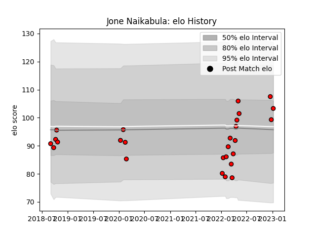

---  
layout: page  
title: Jone Naikabula  
date: 2023-01-13 11:31:38.621597  
categories: player  
---
# Jone Naikabula

## Positions: W

## Current elo: 103.0

## Current Percentile: 61.0

# Elo History

# Match History

| Team                      |   Appearances |   Win Rate |
|:--------------------------|--------------:|-----------:|
| Toshiba Brave Lupus Tokyo |            26 |   0.576923 |

| Opponent                          |   Matches |   Win Rate |
|:----------------------------------|----------:|-----------:|
| Shizuoka Blue Revs                |         4 |   0.75     |
| Saitama Wild Knights              |         3 |   0        |
| Tokyo Sungoliath                  |         3 |   0.666667 |
| Black Rams Tokyo                  |         2 |   1        |
| Kobelco Kobe Steelers             |         2 |   0.5      |
| Kubota Spears Funabashi Tokyo-Bay |         2 |   0        |
| NTT Docomo Red Hurricanes Osaka   |         2 |   1        |
| Toyota Verblitz                   |         2 |   0.5      |
| Yokohama Canon Eagles             |         2 |   0.5      |
| Coca-Cola Red Sparks              |         1 |   1        |
| Green Rockets Tokatsu             |         1 |   1        |
| Mie Honda Heat                    |         1 |   0        |
| Mitsubishi Dynaboars              |         1 |   1        |