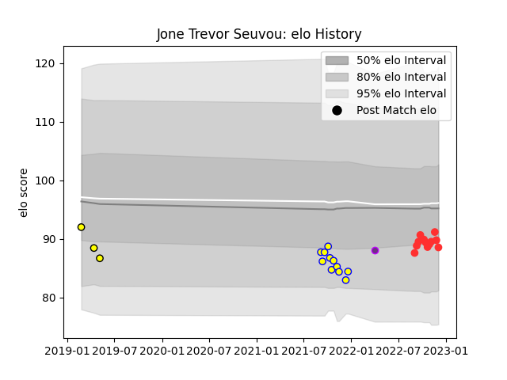

---  
layout: page  
title: Jone Trevor Seuvou  
date: 2022-12-09 13:08:52.652720  
categories: player  
---
# Jone Trevor Seuvou

## Positions: L

## Current elo: 89.0

## Current Percentile: 26.0

# Elo History

# Match History

| Team        |   Appearances |   Win Rate |
|:------------|--------------:|-----------:|
| Tarbes      |            12 |   0.416667 |
| Aubenas     |            11 |   0.318182 |
| Carcassonne |             3 |   0        |
| US Bressane |             1 |   0        |

| Opponent                   |   Matches |   Win Rate |
|:---------------------------|----------:|-----------:|
| Massy                      |         2 |        0   |
| Dax                        |         2 |        0.5 |
| Suresnes                   |         2 |        0   |
| Oyonnax                    |         2 |        0   |
| Nice                       |         2 |        0   |
| Blagnac                    |         2 |        0   |
| Valence Romans Drome Rugby |         2 |        0   |
| Chambery                   |         2 |        0   |
| Bourgoin-Jallieu           |         2 |        1   |
| Cognac Saint Jean d'Angély |         1 |        1   |
| Dijon                      |         1 |        0.5 |
| Narbonne                   |         1 |        1   |
| Carqueiranne-Hyères        |         1 |        0   |
| Brive                      |         1 |        0   |
| Rennes                     |         1 |        1   |
| Soyaux-Angouleme           |         1 |        0   |
| Tarbes                     |         1 |        1   |
| Albi                       |         1 |        1   |