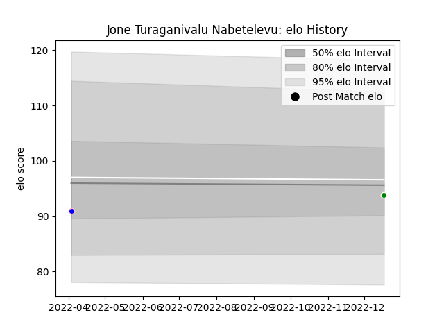

---  
layout: page  
title: Jone Turaganivalu Nabetelevu  
date: 2023-02-02 19:13:44.457063  
categories: player  
---
# Jone Turaganivalu Nabetelevu

## Positions: W, C

## Current elo: 92.0

## Current Percentile: 28.0

# Elo History

# Match History

| Team              |   Appearances |   Win Rate |
|:------------------|--------------:|-----------:|
| Kurita Water Gush |             6 |   0.166667 |
| Toyota Verblitz   |             6 |   0.333333 |

| Opponent                         |   Matches |   Win Rate |
|:---------------------------------|----------:|-----------:|
| Chugoku Red Regulions            |         2 |        0.5 |
| Munakata Sanix Blues             |         2 |        0   |
| Black Rams Tokyo                 |         1 |        0   |
| Kobelco Kobe Steelers            |         1 |        1   |
| Mitsubishi Dynaboars             |         1 |        0   |
| Saitama Wild Knights             |         1 |        0   |
| Shimizu Blue Sharks              |         1 |        0   |
| Shizuoka Blue Revs               |         1 |        1   |
| Toshiba Brave Lupus Tokyo        |         1 |        0   |
| Toyota Industries Shuttles Aichi |         1 |        0   |