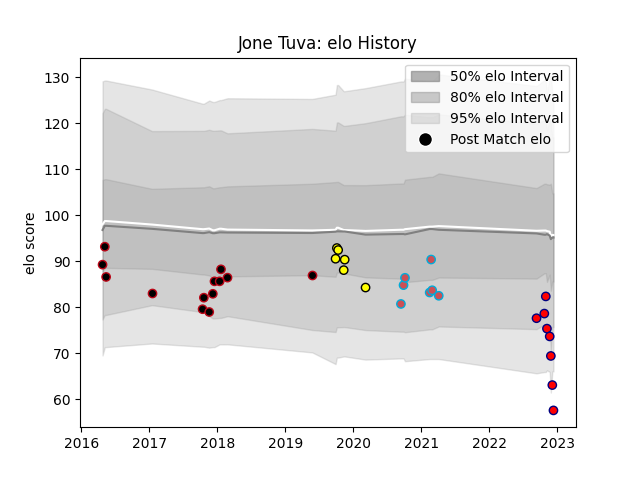

---  
layout: page  
title: Jone Tuva  
date: 2022-12-14 11:25:26.883752  
categories: player  
---
# Jone Tuva

## Positions: W, C

## Current elo: 61.0

## Current Percentile: 0.0

# Elo History

# Match History

| Team                       |   Appearances |   Win Rate |
|:---------------------------|--------------:|-----------:|
| Lyon                       |            12 |       0.25 |
| Cognac Saint Jean d'Angély |             8 |       0    |
| Bourgoin-Jallieu           |             5 |       0.4  |
| Carcassonne                |             5 |       0.6  |

| Opponent            |   Matches |   Win Rate |
|:--------------------|----------:|-----------:|
| Albi                |         2 |        0   |
| Narbonne            |         2 |        0   |
| Cardiff Blues       |         2 |        0   |
| Stade Toulousain    |         2 |        0.5 |
| Sale Sharks         |         2 |        0.5 |
| Colomiers           |         2 |        0   |
| Suresnes            |         1 |        0   |
| Roval Drome XV      |         1 |        1   |
| Rennes              |         1 |        0   |
| Provence Rugby      |         1 |        1   |
| Ospreys             |         1 |        0   |
| Nice                |         1 |        0   |
| Nevers              |         1 |        1   |
| Massy               |         1 |        0   |
| Aurillac            |         1 |        0   |
| Grenoble            |         1 |        1   |
| Dijon               |         1 |        1   |
| Dax                 |         1 |        0   |
| Clermont Auvergne   |         1 |        0   |
| Chambery            |         1 |        1   |
| Castres Olympique   |         1 |        0   |
| Carqueiranne-Hyères |         1 |        0   |
| Bourgoin-Jallieu    |         1 |        0   |
| Tarbes              |         1 |        0   |