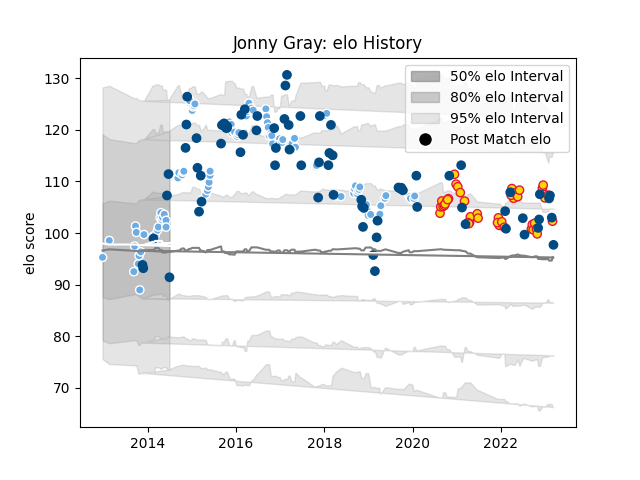

---  
layout: page  
title: Jonny Gray  
date: 2022-11-16 11:42:19.367377  
categories: player  
---
# Jonny Gray

## Positions: L

## Country: Scotland

## Current elo: 105.0

## Current Percentile: 78.0

# Elo History

# Match History

| Team             |   Appearances |   Win Rate |
|:-----------------|--------------:|-----------:|
| Glasgow Warriors |           110 |   0.618182 |
| Scotland         |            66 |   0.462121 |
| Exeter Chiefs    |            31 |   0.709677 |

| Opponent                 |   Matches |   Win Rate |
|:-------------------------|----------:|-----------:|
| Edinburgh                |        12 |   0.416667 |
| Leinster                 |        11 |   0.409091 |
| Munster                  |         9 |   0.555556 |
| Wales                    |         9 |   0.222222 |
| Ulster                   |         9 |   0.777778 |
| England                  |         9 |   0.388889 |
| Ireland                  |         8 |   0.125    |
| Cardiff Blues            |         7 |   0.857143 |
| Scarlets                 |         7 |   0.714286 |
| Connacht                 |         7 |   0.714286 |
| Saracens                 |         7 |   0.142857 |
| France                   |         6 |   0.333333 |
| Argentina                |         6 |   0.666667 |
| Racing 92                |         5 |   0.8      |
| Leicester Tigers         |         5 |   0.8      |
| Bath Rugby               |         5 |   0.8      |
| Italy                    |         5 |   0.8      |
| Montpellier Herault      |         4 |   0.5      |
| Australia                |         4 |   0.5      |
| Zebre                    |         4 |   1        |
| Dragons                  |         4 |   0.75     |
| Harlequins               |         4 |   0.5      |
| Exeter Chiefs            |         4 |   0.625    |
| Japan                    |         4 |   0.75     |
| Benetton Treviso         |         4 |   1        |
| Bristol Rugby            |         4 |   0.5      |
| Stade Toulousain         |         3 |   0.333333 |
| Gloucester Rugby         |         3 |   0.666667 |
| Worcester Warriors       |         3 |   1        |
| Fiji                     |         3 |   0.666667 |
| New Zealand              |         3 |   0        |
| Northampton Saints       |         3 |   0.333333 |
| Ospreys                  |         3 |   0.666667 |
| Sale Sharks              |         3 |   1        |
| Samoa                    |         3 |   1        |
| Wasps                    |         2 |   1        |
| La Rochelle              |         2 |   0.5      |
| South Africa             |         2 |   0        |
| Cheetahs                 |         2 |   1        |
| Georgia                  |         2 |   1        |
| Lyon                     |         2 |   1        |
| Southern Kings           |         1 |   1        |
| Tonga                    |         1 |   1        |
| Toulon                   |         1 |   0        |
| United States of America |         1 |   1        |
| London Irish             |         1 |   0        |