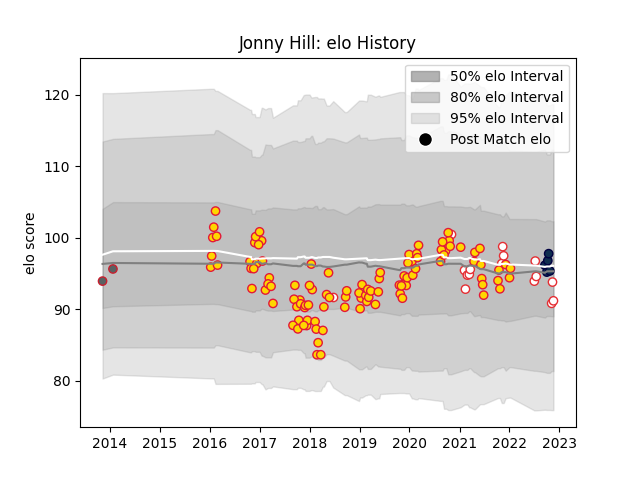

---  
layout: page  
title: Jonny Hill  
date: 2022-11-15 23:44:29.621030  
categories: player  
---
# Jonny Hill

## Positions: L

## Country: England

## Current elo: 96.0

## Current Percentile: 41.0

# Elo History

# Match History

| Team             |   Appearances |   Win Rate |
|:-----------------|--------------:|-----------:|
| Exeter Chiefs    |           105 |   0.738095 |
| England          |            15 |   0.666667 |
| Sale Sharks      |             5 |   0.8      |
| Gloucester Rugby |             2 |   0        |

| Opponent            |   Matches |   Win Rate |
|:--------------------|----------:|-----------:|
| Sale Sharks         |        12 |   0.833333 |
| Harlequins          |        10 |   0.5      |
| Bath Rugby          |        10 |   0.8      |
| Worcester Warriors  |         9 |   0.888889 |
| Northampton Saints  |         9 |   0.777778 |
| Leicester Tigers    |         7 |   0.857143 |
| Bristol Rugby       |         6 |   0.666667 |
| Saracens            |         6 |   0.666667 |
| Newcastle Falcons   |         6 |   1        |
| Gloucester Rugby    |         6 |   0.666667 |
| Wasps               |         5 |   0.7      |
| London Irish        |         5 |   0.8      |
| Australia           |         4 |   0.75     |
| Glasgow Warriors    |         3 |   0.666667 |
| Bordeaux Begles     |         2 |   0        |
| La Rochelle         |         2 |   1        |
| Leinster            |         2 |   0        |
| Montpellier Herault |         2 |   1        |
| Ulster              |         2 |   0.5      |
| Italy               |         2 |   1        |
| South Africa        |         2 |   1        |
| Ireland             |         1 |   0        |
| Scarlets            |         1 |   0        |
| Wales               |         1 |   0        |
| Tonga               |         1 |   1        |
| Stade Toulousain    |         1 |   1        |
| Scotland            |         1 |   0        |
| Racing 92           |         1 |   1        |
| Castres Olympique   |         1 |   1        |
| Clermont Auvergne   |         1 |   0        |
| Ospreys             |         1 |   1        |
| Exeter Chiefs       |         1 |   1        |
| France              |         1 |   1        |
| Munster             |         1 |   0        |
| Japan               |         1 |   1        |
| Argentina           |         1 |   0        |