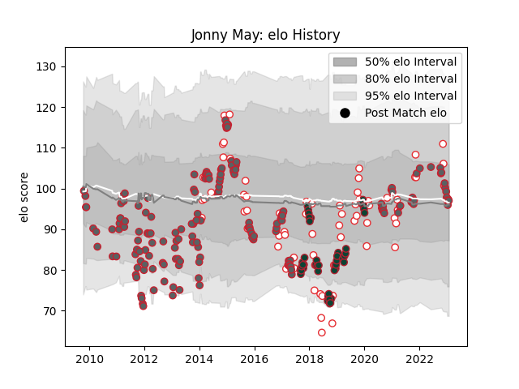

---  
layout: page  
title: Jonny May  
date: 2023-03-17 17:16:50.664470  
categories: player  
---
# Jonny May

## Positions: W

## Country: England

## Current elo: 105.0

## Current Percentile: 79.0

# Elo History

# Match History

| Team             |   Appearances |   Win Rate |
|:-----------------|--------------:|-----------:|
| Gloucester Rugby |           173 |   0.534682 |
| England          |            68 |   0.676471 |
| Leicester Tigers |            44 |   0.443182 |

| Opponent             |   Matches |   Win Rate |
|:---------------------|----------:|-----------:|
| Northampton Saints   |        21 |   0.357143 |
| Harlequins           |        16 |   0.375    |
| Exeter Chiefs        |        16 |   0.3125   |
| Newcastle Falcons    |        15 |   0.666667 |
| Wasps                |        15 |   0.333333 |
| Sale Sharks          |        14 |   0.5      |
| London Irish         |        14 |   0.892857 |
| Bath Rugby           |        12 |   0.333333 |
| Worcester Warriors   |        12 |   0.708333 |
| Leicester Tigers     |        12 |   0.375    |
| Saracens             |        10 |   0.4      |
| South Africa         |         9 |   0.444444 |
| France               |         8 |   0.5      |
| Italy                |         8 |   1        |
| Wales                |         8 |   0.625    |
| Australia            |         7 |   0.857143 |
| Ireland              |         7 |   0.714286 |
| Bristol Rugby        |         6 |   0.5      |
| New Zealand          |         5 |   0.3      |
| Scotland             |         5 |   0.5      |
| La Rochelle          |         4 |   0.25     |
| Racing 92            |         4 |   0        |
| Munster              |         4 |   0        |
| Connacht             |         4 |   1        |
| Argentina            |         4 |   1        |
| Edinburgh            |         4 |   0.75     |
| Bordeaux Begles      |         3 |   1        |
| Benetton Treviso     |         3 |   1        |
| Dragons              |         3 |   0.666667 |
| Stade Toulousain     |         2 |   0.5      |
| Gloucester Rugby     |         2 |   1        |
| Tonga                |         2 |   1        |
| London Welsh         |         2 |   1        |
| Cardiff Blues        |         2 |   0.5      |
| Oyonnax              |         2 |   1        |
| Perpignan            |         2 |   1        |
| Bayonne              |         2 |   1        |
| Samoa                |         2 |   1        |
| Stade Francais Paris |         1 |   0        |
| Yorkshire Carnegie   |         1 |   1        |
| Ulster               |         1 |   0        |
| Leinster             |         1 |   0        |
| Scarlets             |         1 |   1        |
| Mont-de-Marsan       |         1 |   1        |
| Japan                |         1 |   1        |
| Fiji                 |         1 |   1        |
| Castres Olympique    |         1 |   1        |
| Calvisano            |         1 |   1        |
| Brive                |         1 |   1        |
| Biarritz Olympique   |         1 |   0        |
| Barbarians           |         1 |   0        |
| Zebre                |         1 |   1        |