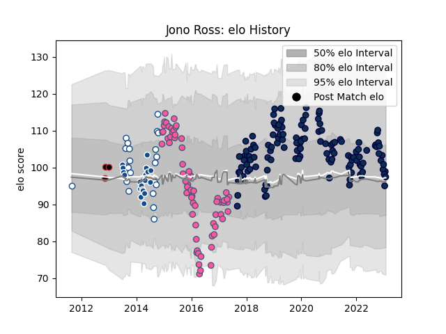

---  
layout: page  
title: Jono Ross  
date: 2022-12-14 11:18:11.137813  
categories: player  
---
# Jono Ross

## Positions: FL, N8

## Current elo: 99.0

## Current Percentile: 59.0

# Elo History

# Match History

| Team                 |   Appearances |   Win Rate |
|:---------------------|--------------:|-----------:|
| Sale Sharks          |           123 |   0.569106 |
| Stade Francais Paris |            65 |   0.530769 |
| Blue Bulls           |            22 |   0.477273 |
| Bulls                |            19 |   0.5      |
| Saracens             |             3 |   0.666667 |

| Opponent                 |   Matches |   Win Rate |
|:-------------------------|----------:|-----------:|
| Leicester Tigers         |        14 |   0.571429 |
| Exeter Chiefs            |        13 |   0.230769 |
| Northampton Saints       |        12 |   0.833333 |
| Harlequins               |        12 |   0.583333 |
| Bath Rugby               |        11 |   0.545455 |
| Gloucester Rugby         |        11 |   0.727273 |
| London Irish             |         9 |   0.888889 |
| Wasps                    |         8 |   0.75     |
| Saracens                 |         8 |   0.125    |
| Worcester Warriors       |         8 |   0.625    |
| La Rochelle              |         7 |   0.5      |
| Bristol Rugby            |         7 |   0.642857 |
| Newcastle Falcons        |         6 |   0.333333 |
| Western Province         |         5 |   0.1      |
| Stade Toulousain         |         5 |   0.3      |
| Grenoble                 |         5 |   0.4      |
| Golden Lions             |         4 |   0.25     |
| Racing 92                |         4 |   0.75     |
| Toulon                   |         4 |   0.25     |
| Lyon                     |         4 |   0.5      |
| Bordeaux Begles          |         4 |   0.5      |
| Griquas                  |         4 |   1        |
| Montpellier Herault      |         4 |   0.5      |
| Connacht                 |         3 |   0.666667 |
| Brive                    |         3 |   0.333333 |
| Sharks                   |         3 |   0.666667 |
| Free State Cheetahs      |         3 |   0.666667 |
| Clermont Auvergne        |         3 |   1        |
| Bayonne                  |         3 |   0.666667 |
| Pau                      |         3 |   0.333333 |
| Castres Olympique        |         3 |   0.666667 |
| Oyonnax                  |         3 |   0.333333 |
| Natal Sharks             |         3 |   0        |
| Stormers                 |         3 |   0.333333 |
| Brumbies                 |         2 |   0.5      |
| Cheetahs                 |         2 |   0.5      |
| Perpignan                |         2 |   1        |
| Munster                  |         2 |   0.5      |
| Glasgow Warriors         |         2 |   0        |
| Eastern Province Kings   |         2 |   1        |
| Lions                    |         2 |   0.5      |
| Timisoara Saracens       |         1 |   1        |
| Western Force            |         1 |   0        |
| Ulster                   |         1 |   1        |
| Southern Kings           |         1 |   1        |
| Cardiff Blues            |         1 |   1        |
| Benetton Treviso         |         1 |   1        |
| Sale Sharks              |         1 |   0        |
| Pumas                    |         1 |   1        |
| Blues                    |         1 |   1        |
| New South Wales Waratahs |         1 |   0        |
| Melbourne Rebels         |         1 |   1        |
| Highlanders              |         1 |   0        |
| Bucuresti                |         1 |   1        |
| Edinburgh                |         1 |   1        |
| Chiefs                   |         1 |   0.5      |
| Agen                     |         1 |   0        |