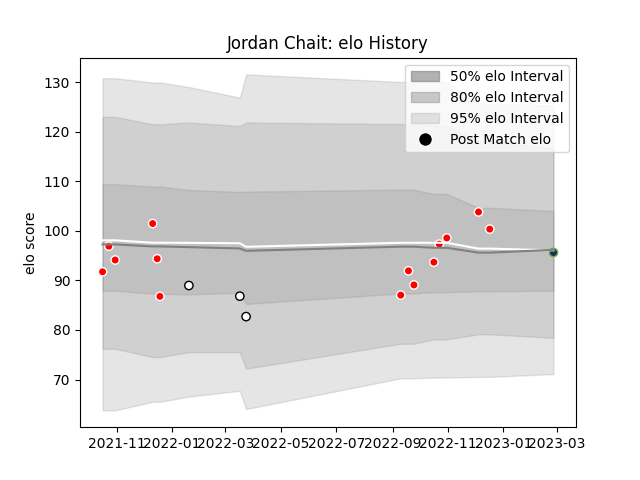

---  
layout: page  
title: Jordan Chait  
date: 2023-02-28 11:05:36.320044  
categories: player  
---
# Jordan Chait

## Positions: FH

## Current elo: 96.0

## Current Percentile: 64.0

# Elo History

# Match History

| Team              |   Appearances |   Win Rate |
|:------------------|--------------:|-----------:|
| Tel-Aviv Heat     |            14 |   0.607143 |
| Natal Sharks      |             3 |   0.333333 |
| Seattle Seawolves |             1 |   1        |

| Opponent               |   Matches |   Win Rate |
|:-----------------------|----------:|-----------:|
| Black Lion             |         5 |        0.3 |
| Enisey-STM Krasnoyarsk |         2 |        0.5 |
| Lokomotiv Penza        |         2 |        1   |
| RC Batumi              |         2 |        0.5 |
| Romanian Wolves        |         2 |        1   |
| Blue Bulls             |         1 |        0   |
| Free State Cheetahs    |         1 |        0   |
| Griquas                |         1 |        1   |
| Lusitanos XV           |         1 |        1   |
| Rugby ATL              |         1 |        1   |