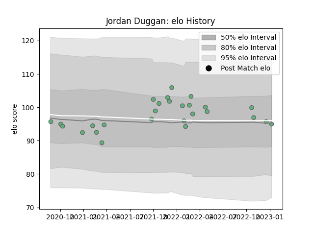

---  
layout: page  
title: Jordan Duggan  
date: 2022-12-18 16:34:02.466798  
categories: player  
---
# Jordan Duggan

## Positions: P

## Current elo: 94.0

## Current Percentile: 36.0

# Elo History

# Match History

| Team     |   Appearances |   Win Rate |
|:---------|--------------:|-----------:|
| Connacht |            25 |       0.52 |

| Opponent             |   Matches |   Win Rate |
|:---------------------|----------:|-----------:|
| Ulster               |         4 |   0.5      |
| Cardiff Blues        |         3 |   0.333333 |
| Scarlets             |         3 |   0.666667 |
| Dragons              |         2 |   0.5      |
| Edinburgh            |         2 |   0        |
| Glasgow Warriors     |         2 |   0.5      |
| Ospreys              |         2 |   1        |
| Brive                |         1 |   1        |
| Bulls                |         1 |   1        |
| Leinster             |         1 |   0        |
| Lions                |         1 |   1        |
| Sharks               |         1 |   0        |
| Stade Francais Paris |         1 |   0        |
| Stormers             |         1 |   1        |