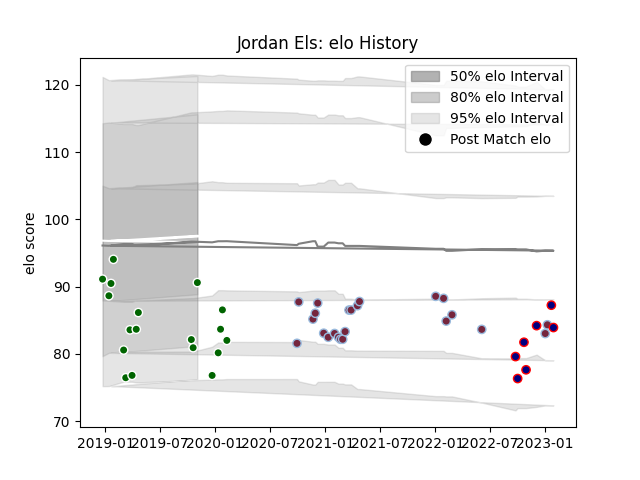

---  
layout: page  
title: Jordan Els  
date: 2023-01-06 00:18:45.922635  
categories: player  
---
# Jordan Els

## Positions: P

## Current elo: 101.0

## Current Percentile: 37.0

# Elo History

# Match History

| Team                |   Appearances |   Win Rate |
|:--------------------|--------------:|-----------:|
| Harlequins          |            22 |   0.568182 |
| Ealing Trailfinders |            18 |   0.75     |
| London Scottish     |             5 |   0.2      |

| Opponent            |   Matches |   Win Rate |
|:--------------------|----------:|-----------:|
| Jersey              |         5 |   0.8      |
| Northampton Saints  |         3 |   0.666667 |
| Gloucester Rugby    |         3 |   1        |
| Leicester Tigers    |         2 |   1        |
| Worcester Warriors  |         2 |   1        |
| Wasps               |         2 |   0.5      |
| Sale Sharks         |         2 |   0.5      |
| Nottingham          |         2 |   1        |
| Newcastle Falcons   |         2 |   0        |
| London Scottish     |         2 |   1        |
| London Irish        |         2 |   0.75     |
| Ampthill            |         2 |   0.5      |
| Exeter Chiefs       |         2 |   0        |
| Coventry            |         2 |   0.75     |
| Cornish Pirates     |         2 |   0        |
| Bristol Rugby       |         2 |   0        |
| Bedford             |         2 |   0.5      |
| Bath Rugby          |         1 |   0        |
| Hartpury College    |         1 |   1        |
| Ealing Trailfinders |         1 |   0        |
| Richmond            |         1 |   0        |
| Caldy               |         1 |   1        |
| Yorkshire Carnegie  |         1 |   1        |