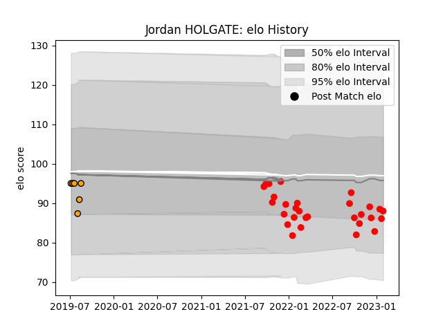

---  
layout: page  
title: Jordan HOLGATE  
date: 2023-03-30 11:30:33.587316  
categories: player  
---
# Jordan HOLGATE

Last updated: 2023-03-30
## Positions: C

## Current elo: 92.0

## Current Percentile: 25.0

# Elo History

# Match History

| Team             |   Appearances |   Win Rate |
|:-----------------|--------------:|-----------:|
| Jersey           |            31 |    0.83871 |
| Boland Cavaliers |             6 |    0.25    |

| Opponent               |   Matches |   Win Rate |
|:-----------------------|----------:|-----------:|
| Richmond               |         4 |   1        |
| Coventry               |         4 |   0.875    |
| Ampthill               |         3 |   0.833333 |
| Cornish Pirates        |         3 |   1        |
| Doncaster              |         3 |   0.333333 |
| Nottingham             |         3 |   1        |
| London Scottish        |         3 |   1        |
| Hartpury College       |         3 |   1        |
| Caldy                  |         2 |   1        |
| Bedford                |         2 |   0.5      |
| Leopards               |         1 |   0        |
| Eastern Province Kings |         1 |   0        |
| Jaguares XV            |         1 |   0        |
| Griffons               |         1 |   0.5      |
| Ealing Trailfinders    |         1 |   0        |
| Border Bulldogs        |         1 |   1        |
| Valke                  |         1 |   0        |