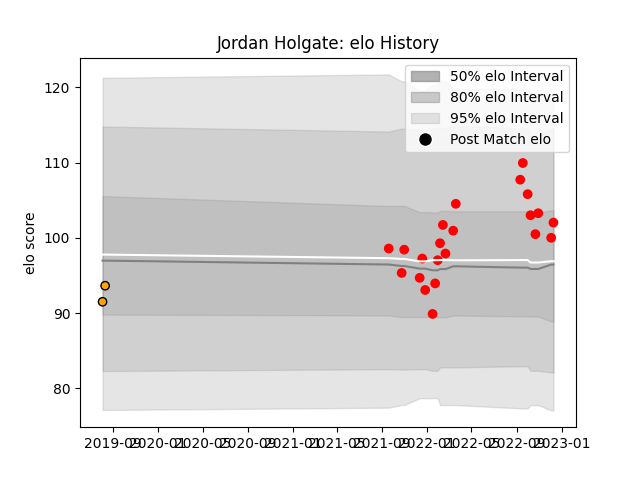

---  
layout: page  
title: Jordan Holgate  
date: 2022-12-18 16:21:51.700367  
categories: player  
---
# Jordan Holgate

## Positions: C

## Current elo: 102.0

## Current Percentile: 64.0

# Elo History

# Match History

| Team             |   Appearances |   Win Rate |
|:-----------------|--------------:|-----------:|
| Jersey           |            22 |   0.840909 |
| Boland Cavaliers |             2 |   0        |

| Opponent            |   Matches |   Win Rate |
|:--------------------|----------:|-----------:|
| Ampthill            |         3 |   0.833333 |
| Coventry            |         3 |   1        |
| Nottingham          |         3 |   1        |
| Richmond            |         3 |   1        |
| Doncaster           |         2 |   0.5      |
| Hartpury College    |         2 |   1        |
| London Scottish     |         2 |   1        |
| Bedford             |         1 |   0        |
| Caldy               |         1 |   1        |
| Cornish Pirates     |         1 |   1        |
| Ealing Trailfinders |         1 |   0        |
| Leopards            |         1 |   0        |
| Valke               |         1 |   0        |