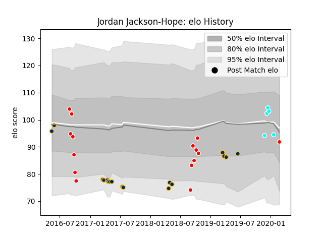

---  
layout: page  
title: Jordan Jackson-Hope  
date: 2023-02-24 02:25:23.566563  
categories: player  
---
# Jordan Jackson-Hope

## Positions: C, FH

## Current elo: 92.0

## Current Percentile: 42.0

# Elo History

# Match History

| Team                             |   Appearances |   Win Rate |
|:---------------------------------|--------------:|-----------:|
| Brumbies                         |            17 |   0.294118 |
| Canberra Vikings                 |            14 |   0.5      |
| Toyota Industries Shuttles Aichi |             5 |   0.6      |
| Sunwolves                        |             1 |   0        |

| Opponent                 |   Matches |   Win Rate |
|:-------------------------|----------:|-----------:|
| Melbourne Rebels         |         3 |   0.333333 |
| Queensland Reds          |         3 |   0.333333 |
| Crusaders                |         2 |   0        |
| Fijian Drua              |         2 |   0        |
| Queensland Country       |         2 |   0.5      |
| Hurricanes               |         2 |   0        |
| New South Wales Waratahs |         2 |   1        |
| NSW Country Eagles       |         2 |   0.5      |
| Brisbane City            |         2 |   1        |
| Blues                    |         1 |   0        |
| Sydney Rays              |         1 |   1        |
| Sunwolves                |         1 |   1        |
| Perth Spirit             |         1 |   0        |
| North Harbour Rays       |         1 |   0        |
| Melbourne Rising         |         1 |   0        |
| Kyuden Voltex            |         1 |   1        |
| Lions                    |         1 |   0        |
| Kurita Water Gush        |         1 |   1        |
| Kamaishi Seawaves        |         1 |   1        |
| Jaguares                 |         1 |   0        |
| Highlanders              |         1 |   0        |
| Hanazono Kintetsu Liners |         1 |   0        |
| Greater Sydney Rams      |         1 |   1        |
| Coca-Cola Red Sparks     |         1 |   0        |
| Chiefs                   |         1 |   0        |
| Western Force            |         1 |   1        |