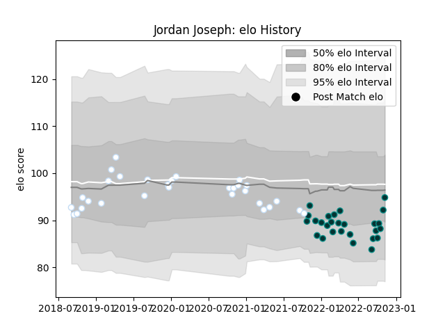

---  
layout: page  
title: Jordan Joseph  
date: 2023-01-13 11:27:37.115990  
categories: player  
---
# Jordan Joseph

## Positions: N8

## Current elo: 80.0

## Current Percentile: 25.0

# Elo History

# Match History

| Team      |   Appearances |   Win Rate |
|:----------|--------------:|-----------:|
| Pau       |            31 |   0.451613 |
| Racing 92 |            31 |   0.564516 |

| Opponent             |   Matches |   Win Rate |
|:---------------------|----------:|-----------:|
| Clermont Auvergne    |         7 |   0.5      |
| Stade Toulousain     |         6 |   0.333333 |
| Stade Francais Paris |         5 |   0.6      |
| Toulon               |         5 |   0.3      |
| Castres Olympique    |         4 |   0.25     |
| La Rochelle          |         4 |   0.5      |
| Bayonne              |         4 |   0.375    |
| Biarritz Olympique   |         3 |   0.666667 |
| Lyon                 |         3 |   0        |
| Montpellier Herault  |         3 |   0.333333 |
| Perpignan            |         3 |   1        |
| Agen                 |         2 |   1        |
| Bordeaux Begles      |         2 |   1        |
| Brive                |         2 |   1        |
| Grenoble             |         2 |   1        |
| Pau                  |         2 |   0.5      |
| London Irish         |         1 |   0        |
| Racing 92            |         1 |   0        |
| Ospreys              |         1 |   1        |
| Edinburgh            |         1 |   0        |
| Ulster               |         1 |   1        |