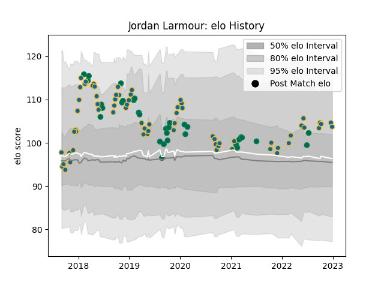

---  
layout: page  
title: Jordan Larmour  
date: 2023-01-06 00:15:53.395841  
categories: player  
---
# Jordan Larmour

## Positions: W, FB

## Country: Ireland

## Current elo: 117.0

## Current Percentile: 84.0

# Elo History

# Match History

| Team     |   Appearances |   Win Rate |
|:---------|--------------:|-----------:|
| Leinster |            69 |    0.84058 |
| Ireland  |            32 |    0.6875  |

| Opponent            |   Matches |   Win Rate |
|:--------------------|----------:|-----------:|
| Munster             |         9 |   0.888889 |
| Benetton Treviso    |         7 |   0.857143 |
| Ulster              |         7 |   0.857143 |
| Scarlets            |         5 |   0.8      |
| England             |         5 |   0.4      |
| Scotland            |         5 |   1        |
| Connacht            |         5 |   0.8      |
| Glasgow Warriors    |         5 |   0.6      |
| Italy               |         4 |   1        |
| Wales               |         4 |   0.5      |
| Dragons             |         4 |   1        |
| Stade Toulousain    |         3 |   0.666667 |
| Australia           |         3 |   0.666667 |
| Southern Kings      |         2 |   1        |
| Northampton Saints  |         2 |   1        |
| New Zealand Maori   |         2 |   0.5      |
| New Zealand         |         2 |   0.5      |
| Edinburgh           |         2 |   1        |
| Exeter Chiefs       |         2 |   1        |
| Lyon                |         2 |   1        |
| Japan               |         2 |   0.5      |
| Wasps               |         2 |   1        |
| Saracens            |         2 |   0        |
| France              |         2 |   0.5      |
| Bath Rugby          |         2 |   1        |
| Sharks              |         1 |   1        |
| Argentina           |         1 |   1        |
| Samoa               |         1 |   1        |
| Russia              |         1 |   1        |
| Racing 92           |         1 |   1        |
| Ospreys             |         1 |   1        |
| Montpellier Herault |         1 |   1        |
| Gloucester Rugby    |         1 |   1        |
| Cardiff Blues       |         1 |   1        |
| Bulls               |         1 |   0        |
| Zebre               |         1 |   1        |