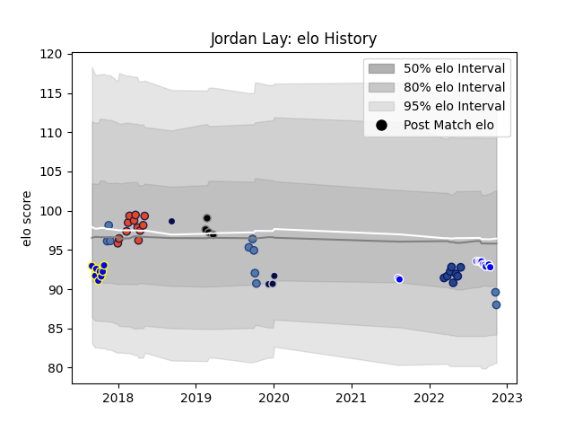

---  
layout: page  
title: Jordan Lay  
date: 2022-11-15 23:41:12.371816  
categories: player  
---
# Jordan Lay

## Positions: P

## Country: Samoa

## Current elo: 88.0

## Current Percentile: 22.0

# Elo History

# Match History

| Team          |   Appearances |   Win Rate |
|:--------------|--------------:|-----------:|
| Edinburgh     |            12 |   0.666667 |
| Auckland      |            11 |   0.454545 |
| Samoa         |            10 |   0.2      |
| Bay of Plenty |             8 |   0.5      |
| Blues         |             8 |   1        |
| Bristol Rugby |             4 |   0.25     |
| Ospreys       |             4 |   0.25     |

| Opponent                 |   Matches |   Win Rate |
|:-------------------------|----------:|-----------:|
| Wellington               |         3 |   0        |
| Ulster                   |         3 |   0.333333 |
| Munster                  |         3 |   0.333333 |
| Otago                    |         3 |   1        |
| Waikato                  |         2 |   0.5      |
| Glasgow Warriors         |         2 |   0.5      |
| Scotland                 |         2 |   0        |
| Canterbury               |         2 |   0.5      |
| Highlanders              |         2 |   1        |
| Dragons                  |         2 |   1        |
| Tasman                   |         2 |   0.5      |
| Connacht                 |         2 |   0.5      |
| Taranaki                 |         1 |   0        |
| Stade Francais Paris     |         1 |   1        |
| Northland                |         1 |   0        |
| Southern Kings           |         1 |   1        |
| Scarlets                 |         1 |   1        |
| Saracens                 |         1 |   0        |
| Russia                   |         1 |   1        |
| Romania                  |         1 |   0        |
| Queensland Reds          |         1 |   1        |
| Wasps                    |         1 |   0        |
| Southland                |         1 |   1        |
| Auckland                 |         1 |   0        |
| North Harbour            |         1 |   1        |
| Georgia                  |         1 |   1        |
| Bay of Plenty            |         1 |   0        |
| Cardiff Blues            |         1 |   0        |
| Chiefs                   |         1 |   1        |
| Crusaders                |         1 |   1        |
| England                  |         1 |   0        |
| Fijian Drua              |         1 |   1        |
| Ireland                  |         1 |   0        |
| New South Wales Waratahs |         1 |   1        |
| Italy                    |         1 |   0        |
| Japan                    |         1 |   0        |
| Leicester Tigers         |         1 |   0        |
| Leinster                 |         1 |   1        |
| Manawatu                 |         1 |   1        |
| Australia                |         1 |   0        |
| Melbourne Rebels         |         1 |   1        |