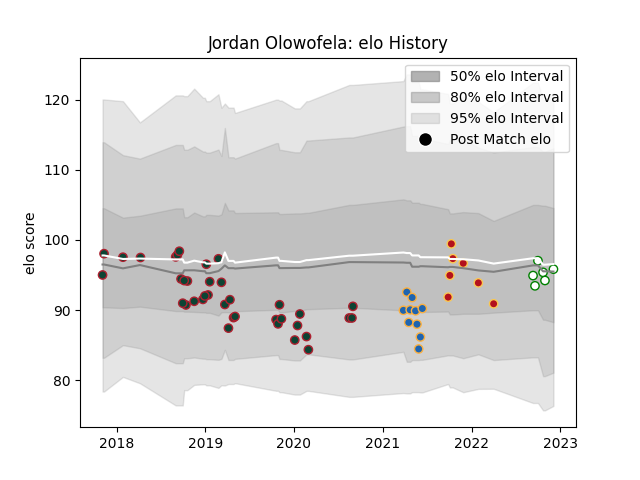

---  
layout: page  
title: Jordan Olowofela  
date: 2022-12-12 15:06:28.476372  
categories: player  
---
# Jordan Olowofela

## Positions: W, FB

## Current elo: 96.0

## Current Percentile: 45.0

# Elo History

# Match History

| Team             |   Appearances |   Win Rate |
|:-----------------|--------------:|-----------:|
| Leicester Tigers |            37 |   0.405405 |
| Western Force    |            10 |   0.3      |
| Dragons          |             7 |   0.214286 |
| Nottingham       |             6 |   0.5      |

| Opponent                 |   Matches |   Win Rate |
|:-------------------------|----------:|-----------:|
| Gloucester Rugby         |         5 |   0.6      |
| Bath Rugby               |         4 |   0.25     |
| Worcester Warriors       |         4 |   0.25     |
| Exeter Chiefs            |         3 |   0        |
| Sale Sharks              |         3 |   0.333333 |
| London Irish             |         2 |   0.5      |
| Scarlets                 |         2 |   0.5      |
| Bristol Rugby            |         2 |   0.5      |
| Northampton Saints       |         2 |   0.5      |
| Harlequins               |         2 |   0.5      |
| Newcastle Falcons        |         2 |   1        |
| Ulster                   |         2 |   0        |
| Cardiff Blues            |         2 |   1        |
| Brumbies                 |         2 |   0        |
| Sharks                   |         1 |   0        |
| New South Wales Waratahs |         1 |   1        |
| Stormers                 |         1 |   0        |
| Richmond                 |         1 |   1        |
| Wasps                    |         1 |   0        |
| Queensland Reds          |         1 |   1        |
| Ospreys                  |         1 |   0        |
| Saracens                 |         1 |   0        |
| Blues                    |         1 |   0        |
| Melbourne Rebels         |         1 |   1        |
| London Scottish          |         1 |   1        |
| Leinster                 |         1 |   0        |
| Bedford                  |         1 |   0        |
| Highlanders              |         1 |   0        |
| Benetton Treviso         |         1 |   0.5      |
| Edinburgh                |         1 |   0        |
| Ealing Trailfinders      |         1 |   0        |
| Doncaster                |         1 |   1        |
| Crusaders                |         1 |   0        |
| Cornish Pirates          |         1 |   0        |
| Connacht                 |         1 |   1        |
| Chiefs                   |         1 |   0        |
| Hurricanes               |         1 |   0        |