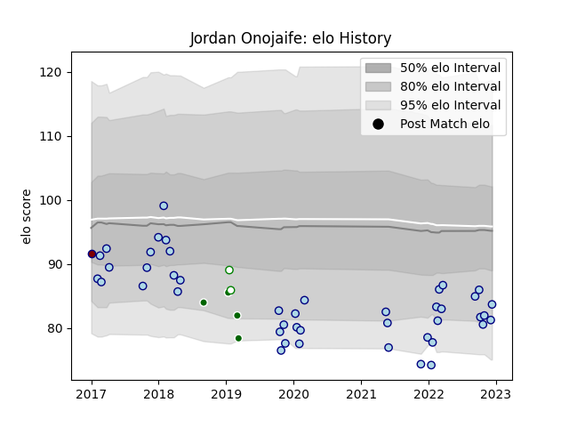

---  
layout: page  
title: Jordan Onojaife  
date: 2022-12-14 11:21:58.634446  
categories: player  
---
# Jordan Onojaife

## Positions: L

## Current elo: 84.0

## Current Percentile: 10.0

# Elo History

# Match History

| Team                |   Appearances |   Win Rate |
|:--------------------|--------------:|-----------:|
| Bedford             |            44 |   0.465909 |
| Ealing Trailfinders |             4 |   0.25     |
| Nottingham          |             2 |   0        |
| Rotherham Titans    |             1 |   0        |

| Opponent            |   Matches |   Win Rate |
|:--------------------|----------:|-----------:|
| Ealing Trailfinders |         6 |   0.166667 |
| Richmond            |         5 |   0.2      |
| London Scottish     |         5 |   0.6      |
| Yorkshire Carnegie  |         4 |   0.5      |
| Nottingham          |         4 |   0.5      |
| Coventry            |         4 |   0.25     |
| Doncaster           |         4 |   0.625    |
| Jersey              |         3 |   0.666667 |
| Hartpury College    |         3 |   1        |
| Cornish Pirates     |         3 |   0        |
| London Irish        |         2 |   0        |
| Rotherham Titans    |         2 |   1        |
| Ampthill            |         2 |   0.5      |
| Bedford             |         1 |   0        |
| Newcastle Falcons   |         1 |   0        |
| Caldy               |         1 |   1        |
| Bristol Rugby       |         1 |   0        |