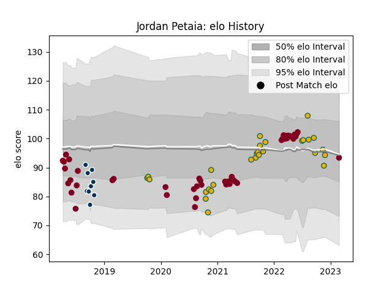

---  
layout: page  
title: Jordan Petaia  
date: 2022-11-15 23:43:24.737505  
categories: player  
---
# Jordan Petaia

## Positions: W, C

## Country: Australia

## Current elo: 112.0

## Current Percentile: 92.0

# Elo History

# Match History

| Team            |   Appearances |   Win Rate |
|:----------------|--------------:|-----------:|
| Queensland Reds |            44 |   0.522727 |
| Australia       |            25 |   0.5      |

| Opponent                 |   Matches |   Win Rate |
|:-------------------------|----------:|-----------:|
| Brumbies                 |        10 |   0.5      |
| Argentina                |         8 |   0.6875   |
| Melbourne Rebels         |         7 |   1        |
| New Zealand              |         7 |   0.142857 |
| New South Wales Waratahs |         7 |   0.571429 |
| Western Force            |         4 |   0.75     |
| Highlanders              |         3 |   0        |
| England                  |         3 |   0.333333 |
| Crusaders                |         3 |   0        |
| Blues                    |         2 |   0        |
| Lions                    |         2 |   0.5      |
| South Africa             |         2 |   1        |
| Sunwolves                |         2 |   0.5      |
| Fijian Drua              |         1 |   1        |
| Georgia                  |         1 |   1        |
| Hurricanes               |         1 |   0        |
| Italy                    |         1 |   0        |
| Moana Pasifika           |         1 |   1        |
| Chiefs                   |         1 |   0        |
| Scotland                 |         1 |   0        |
| Uruguay                  |         1 |   1        |
| Japan                    |         1 |   1        |