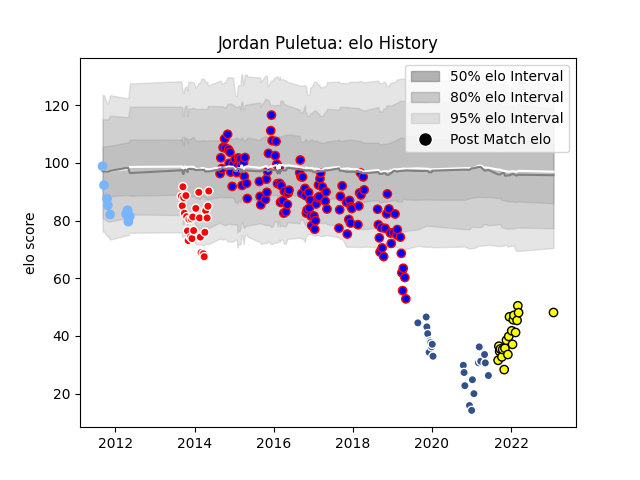

---  
layout: page  
title: Jordan Puletua  
date: 2023-03-21 18:17:04.421951  
categories: player  
---
# Jordan Puletua

Last updated: 2023-03-21
## Positions: C, W

## Current elo: 64.0

## Current Percentile: 4.0

# Elo History

# Match History

| Team        |   Appearances |   Win Rate |
|:------------|--------------:|-----------:|
| Beziers     |           122 |   0.545082 |
| Auch        |            27 |   0.314815 |
| Agen        |            24 |   0        |
| Carcassonne |            20 |   0.6      |
| Périgueux   |            10 |   0.1      |

| Opponent             |   Matches |   Win Rate |
|:---------------------|----------:|-----------:|
| Mont-de-Marsan       |        13 |  0.0769231 |
| Colomiers            |        13 |  0.730769  |
| Aurillac             |        12 |  0.333333  |
| Carcassonne          |        11 |  0.454545  |
| Dax                  |        10 |  0.45      |
| Albi                 |         9 |  0.555556  |
| Narbonne             |         9 |  0.666667  |
| Montauban            |         9 |  0.611111  |
| Agen                 |         8 |  0.625     |
| Biarritz Olympique   |         8 |  0.125     |
| Bourgoin-Jallieu     |         8 |  0.625     |
| Tarbes               |         7 |  0.428571  |
| US Bressane          |         6 |  0.666667  |
| Bayonne              |         6 |  0.5       |
| Perpignan            |         6 |  0.333333  |
| Provence Rugby       |         6 |  0.666667  |
| Pau                  |         5 |  0.2       |
| Soyaux-Angouleme     |         5 |  0.4       |
| Massy                |         5 |  0.8       |
| Vannes               |         5 |  0.6       |
| Oyonnax              |         4 |  0.25      |
| Nevers               |         4 |  0.875     |
| Lyon                 |         4 |  0         |
| La Rochelle          |         4 |  0         |
| Bordeaux Begles      |         4 |  0         |
| Brive                |         3 |  0.333333  |
| Beziers              |         3 |  0.666667  |
| Grenoble             |         2 |  1         |
| Stade Toulousain     |         2 |  0         |
| Toulon               |         2 |  0         |
| Wasps                |         2 |  0         |
| Montpellier Herault  |         1 |  0         |
| London Irish         |         1 |  0         |
| Edinburgh            |         1 |  0         |
| Castres Olympique    |         1 |  0         |
| Rouen                |         1 |  1         |
| Stade Francais Paris |         1 |  0         |
| Benetton Treviso     |         1 |  0         |
| Auch                 |         1 |  0         |