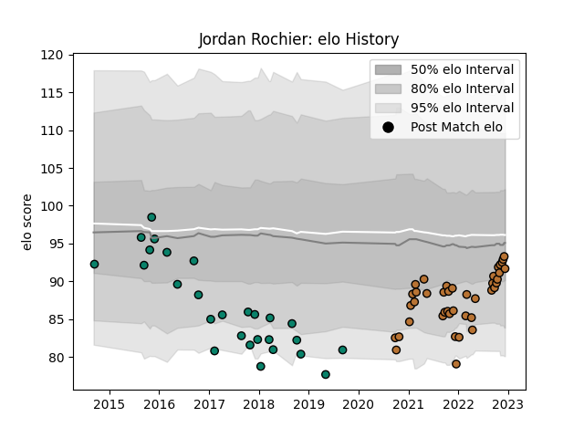

---  
layout: page  
title: Jordan Rochier  
date: 2023-03-17 17:14:41.108064  
categories: player  
---
# Jordan Rochier

## Positions: H

## Current elo: 95.0

## Current Percentile: 66.0

# Elo History

# Match History

| Team      |   Appearances |   Win Rate |
|:----------|--------------:|-----------:|
| Montauban |            83 |   0.457831 |
| Narbonne  |            60 |   0.433333 |

| Opponent                   |   Matches |   Win Rate |
|:---------------------------|----------:|-----------:|
| Aurillac                   |         9 |   0.277778 |
| Mont-de-Marsan             |         8 |   0.25     |
| Biarritz Olympique         |         7 |   0.285714 |
| US Bressane                |         7 |   0.428571 |
| Carcassonne                |         7 |   0.571429 |
| Colomiers                  |         7 |   0.142857 |
| Dax                        |         6 |   0.333333 |
| Beziers                    |         6 |   0.583333 |
| Vannes                     |         5 |   0.8      |
| Narbonne                   |         5 |   0.4      |
| Bayonne                    |         5 |   0        |
| Perpignan                  |         5 |   0.6      |
| Tarbes                     |         5 |   0.6      |
| Albi                       |         5 |   0.6      |
| Provence Rugby             |         5 |   0.6      |
| Nice                       |         4 |   1        |
| Suresnes                   |         4 |   0.75     |
| Soyaux-Angouleme           |         3 |   0.666667 |
| Rouen                      |         3 |   0.666667 |
| Cognac Saint Jean d'Angély |         3 |   1        |
| Bourgoin-Jallieu           |         3 |   0.333333 |
| Nevers                     |         3 |   0.333333 |
| Chambery                   |         3 |   0        |
| Oyonnax                    |         2 |   0        |
| Valence Romans Drome Rugby |         2 |   0        |
| Agen                       |         2 |   0.5      |
| Montauban                  |         2 |   0        |
| Lyon                       |         2 |   0        |
| Grenoble                   |         2 |   0.25     |
| Dijon                      |         2 |   0.5      |
| Blagnac                    |         2 |   0.75     |
| Aubenas                    |         2 |   0.5      |
| Massy                      |         2 |   1        |
| Pau                        |         1 |   0        |
| Rennes                     |         1 |   1        |
| Roval Drome XV             |         1 |   1        |
| Carqueiranne-Hyères        |         1 |   1        |
| Brive                      |         1 |   0        |