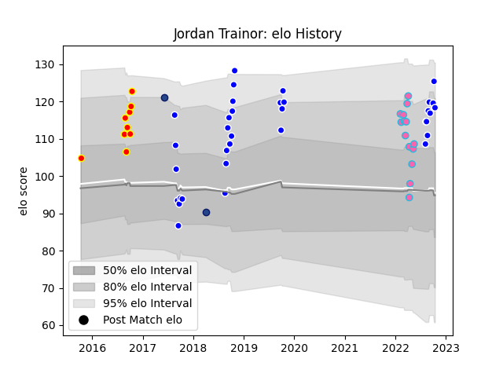

---  
layout: page  
title: Jordan Trainor  
date: 2023-03-17 17:34:27.684478  
categories: player  
---
# Jordan Trainor

## Positions: FB

## Current elo: 118.0

## Current Percentile: 91.0

# Elo History

# Match History

| Team           |   Appearances |   Win Rate |
|:---------------|--------------:|-----------:|
| Auckland       |            34 |   0.647059 |
| L. A. Giltinis |            14 |   0.714286 |
| Waikato        |             9 |   0.666667 |
| Blues          |             2 |   0.5      |

| Opponent               |   Matches |   Win Rate |
|:-----------------------|----------:|-----------:|
| Wellington             |         5 |   0.6      |
| North Harbour          |         4 |   1        |
| Taranaki               |         4 |   0.75     |
| Tasman                 |         4 |   0.25     |
| Northland              |         4 |   0.5      |
| Southland              |         4 |   1        |
| Canterbury             |         4 |   0.5      |
| Waikato                |         3 |   0.333333 |
| Hawke's Bay            |         2 |   1        |
| Houston SaberCats      |         2 |   0.5      |
| Manawatu               |         2 |   1        |
| Counties Manukau       |         2 |   0.5      |
| Otago                  |         2 |   0.5      |
| Austin Gilgronis       |         2 |   0.5      |
| Bay of Plenty          |         2 |   0.5      |
| San Diego Legion       |         2 |   0.5      |
| Sharks                 |         1 |   0        |
| Toronto Arrows         |         1 |   1        |
| Utah Warriors          |         1 |   0        |
| Auckland               |         1 |   1        |
| Seattle Seawolves      |         1 |   1        |
| Rugby New York         |         1 |   1        |
| Rugby ATL              |         1 |   1        |
| R.U. New York          |         1 |   1        |
| New England Free Jacks |         1 |   1        |
| Dallas Jackals         |         1 |   1        |
| Queensland Reds        |         1 |   1        |