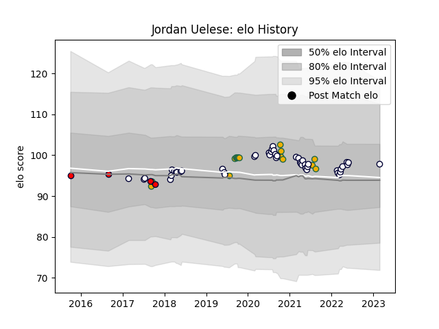

---  
layout: page  
title: Jordan Uelese  
date: 2023-03-02 11:27:34.256734  
categories: player  
---
# Jordan Uelese

## Positions: H

## Country: Australia

## Current elo: 98.0

## Current Percentile: 62.0

# Elo History

# Match History

| Team             |   Appearances |   Win Rate |
|:-----------------|--------------:|-----------:|
| Melbourne Rebels |            46 |   0.380435 |
| Australia        |            16 |   0.4375   |
| Melbourne Rising |             4 |   0        |

| Opponent                 |   Matches |   Win Rate |
|:-------------------------|----------:|-----------:|
| Western Force            |         7 |  0.428571  |
| Queensland Reds          |         7 |  0.214286  |
| New Zealand              |         6 |  0.0833333 |
| Brumbies                 |         5 |  0.4       |
| New South Wales Waratahs |         5 |  0.6       |
| Blues                    |         3 |  0.333333  |
| Sunwolves                |         3 |  1         |
| Hurricanes               |         3 |  0         |
| Highlanders              |         3 |  0.666667  |
| Chiefs                   |         3 |  0         |
| Crusaders                |         2 |  0         |
| Jaguares                 |         2 |  0         |
| South Africa             |         2 |  0.25      |
| Perth Spirit             |         2 |  0         |
| Fiji                     |         1 |  1         |
| Bulls                    |         1 |  0         |
| Wales                    |         1 |  0         |
| Uruguay                  |         1 |  1         |
| Brisbane City            |         1 |  0         |
| Samoa                    |         1 |  1         |
| Canberra Vikings         |         1 |  0         |
| Fijian Drua              |         1 |  1         |
| Lions                    |         1 |  1         |
| England                  |         1 |  0         |
| Georgia                  |         1 |  1         |
| France                   |         1 |  1         |
| Argentina                |         1 |  1         |