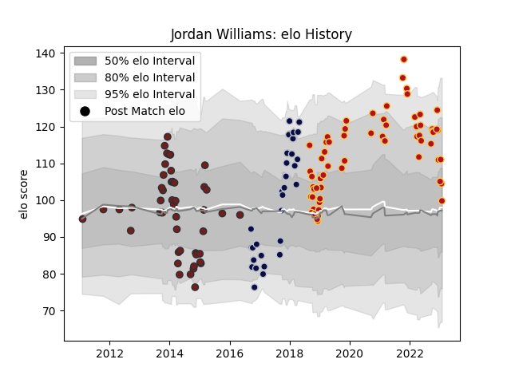

---  
layout: page  
title: Jordan Williams  
date: 2023-02-02 19:00:56.463003  
categories: player  
---
# Jordan Williams

## Positions: FB, W

## Current elo: 100.0

## Current Percentile: 66.0

# Elo History

# Match History

| Team          |   Appearances |   Win Rate |
|:--------------|--------------:|-----------:|
| Dragons       |            63 |   0.253968 |
| Scarlets      |            48 |   0.489583 |
| Bristol Rugby |            30 |   0.633333 |

| Opponent            |   Matches |   Win Rate |
|:--------------------|----------:|-----------:|
| Glasgow Warriors    |         9 |   0.333333 |
| Cardiff Blues       |         9 |   0.111111 |
| Edinburgh           |         9 |   0.444444 |
| Leinster            |         8 |   0.125    |
| Munster             |         7 |   0.285714 |
| Zebre               |         6 |   0.666667 |
| Ospreys             |         6 |   0.5      |
| Connacht            |         6 |   0.666667 |
| Benetton Treviso    |         5 |   0.4      |
| Ulster              |         5 |   0.2      |
| Clermont Auvergne   |         4 |   0        |
| Lions               |         4 |   0.125    |
| Leicester Tigers    |         4 |   0.5      |
| Scarlets            |         3 |   0.333333 |
| Northampton Saints  |         3 |   0        |
| Bath Rugby          |         3 |   0.333333 |
| Dragons             |         3 |   0.666667 |
| Cornish Pirates     |         2 |   1        |
| Timisoara Saracens  |         2 |   1        |
| Sharks              |         2 |   0        |
| Bulls               |         2 |   0        |
| Saracens            |         2 |   0        |
| Racing 92           |         2 |   0.75     |
| Harlequins          |         2 |   0.5      |
| Pau                 |         2 |   0.5      |
| Nottingham          |         2 |   1        |
| Southern Kings      |         2 |   0.75     |
| Yorkshire Carnegie  |         2 |   1        |
| Doncaster           |         2 |   1        |
| London Scottish     |         2 |   1        |
| Bedford             |         2 |   1        |
| Ealing Trailfinders |         2 |   1        |
| Exeter Chiefs       |         2 |   0        |
| Jersey              |         2 |   0.5      |
| Hartpury College    |         2 |   1        |
| Wasps               |         1 |   0        |
| Bristol Rugby       |         1 |   0        |
| Toulon              |         1 |   0        |
| Gloucester Rugby    |         1 |   1        |
| RC Enisei           |         1 |   1        |
| Stormers            |         1 |   0        |
| Sale Sharks         |         1 |   0        |
| Richmond            |         1 |   1        |
| Cheetahs            |         1 |   0        |
| Newcastle Falcons   |         1 |   0        |
| London Irish        |         1 |   0        |