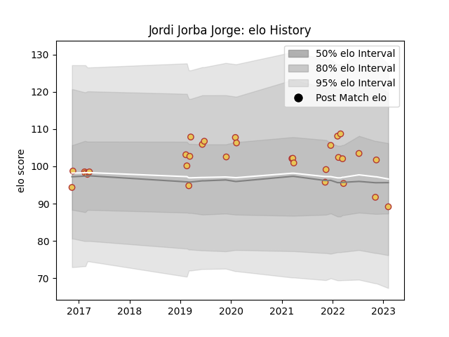

---  
layout: page  
title: Jordi Jorba Jorge  
date: 2022-11-16 11:35:23.811797  
categories: player  
---
# Jordi Jorba Jorge

## Positions: W

## Country: Spain

## Current elo: 99.0

## Current Percentile: 44.0

# Elo History

# Match History

| Team   |   Appearances |   Win Rate |
|:-------|--------------:|-----------:|
| Spain  |            21 |   0.714286 |

| Opponent    |   Matches |   Win Rate |
|:------------|----------:|-----------:|
| Georgia     |         4 |          0 |
| Russia      |         3 |          1 |
| Netherlands |         2 |          1 |
| Romania     |         2 |          1 |
| Belgium     |         1 |          1 |
| Brazil      |         1 |          1 |
| Canada      |         1 |          1 |
| Fiji        |         1 |          0 |
| Germany     |         1 |          1 |
| Hong Kong   |         1 |          1 |
| Namibia     |         1 |          1 |
| Portugal    |         1 |          1 |
| Tonga       |         1 |          0 |
| Uruguay     |         1 |          1 |