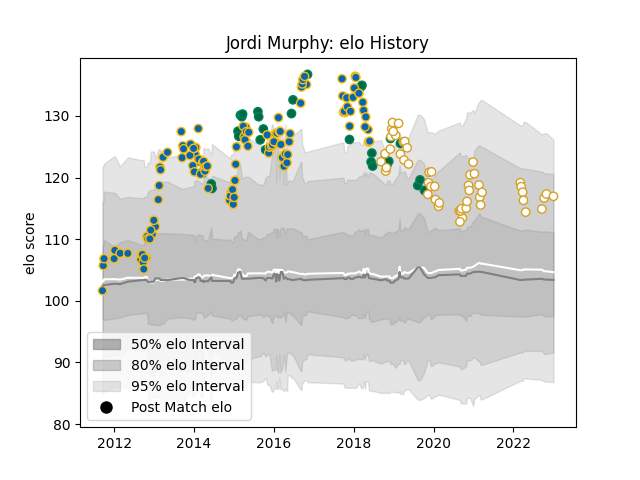

---  
layout: page  
title: Jordi Murphy  
date: 2023-02-02 19:05:40.567538  
categories: player  
---
# Jordi Murphy

## Positions: FL, N8

## Country: Ireland

## Current elo: 122.0

## Current Percentile: 92.0

# Elo History

# Match History

| Team     |   Appearances |   Win Rate |
|:---------|--------------:|-----------:|
| Leinster |           112 |   0.71875  |
| Ulster   |            54 |   0.666667 |
| Ireland  |            31 |   0.806452 |

| Opponent                 |   Matches |   Win Rate |
|:-------------------------|----------:|-----------:|
| Glasgow Warriors         |        14 |   0.428571 |
| Scarlets                 |        13 |   0.923077 |
| Ospreys                  |        13 |   0.653846 |
| Munster                  |        13 |   0.692308 |
| Connacht                 |        12 |   0.666667 |
| Benetton Treviso         |        11 |   0.863636 |
| Edinburgh                |        11 |   0.909091 |
| Dragons                  |        10 |   0.8      |
| Cardiff Blues            |         9 |   1        |
| Ulster                   |         8 |   0.75     |
| Zebre                    |         7 |   1        |
| Leinster                 |         6 |   0.166667 |
| Bath Rugby               |         5 |   0.8      |
| Italy                    |         5 |   1        |
| Wales                    |         4 |   0.5      |
| Toulon                   |         4 |   0        |
| Clermont Auvergne        |         3 |   0.333333 |
| Racing 92                |         3 |   0.666667 |
| Wasps                    |         3 |   0.166667 |
| Scotland                 |         3 |   1        |
| Harlequins               |         3 |   0.666667 |
| Argentina                |         3 |   0.666667 |
| Montpellier Herault      |         3 |   0.666667 |
| Australia                |         3 |   0.666667 |
| England                  |         3 |   0.666667 |
| Stormers                 |         2 |   0.5      |
| Castres Olympique        |         2 |   1        |
| New Zealand              |         2 |   1        |
| Leicester Tigers         |         2 |   1        |
| Cheetahs                 |         2 |   0.5      |
| France                   |         2 |   1        |
| South Africa             |         2 |   0.5      |
| United States of America |         1 |   1        |
| Stade Toulousain         |         1 |   0        |
| Romania                  |         1 |   1        |
| Southern Kings           |         1 |   1        |
| Saracens                 |         1 |   1        |
| Sale Sharks              |         1 |   1        |
| Russia                   |         1 |   1        |
| Bulls                    |         1 |   0        |
| Fiji                     |         1 |   1        |
| Exeter Chiefs            |         1 |   1        |
| Aironi                   |         1 |   1        |